# Big Meaty Book of Races
{: .no_toc }

  

    Table of contents
  

  {: .text-delta }
- TOC
{:toc}

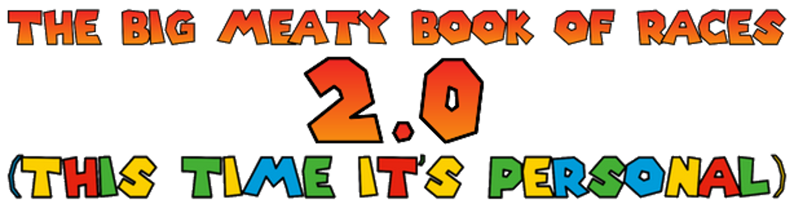
{: .center-img }

{: .specie-callout }
> ## Baddie Box
>
> 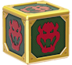
> {: .float-right-desktop }
> From *Super Mario 3D Land*{: .italic }, *Super Mario 3D World*{: .italic }  
>
> These bizarre blocks are capable of continuously conjuring enemies from within themselves. They have been seen conjuring other objects as well, but mooks and minions appear to be their specialty.
>
> ***+1 Heart**{: .heart-color }, **+1 Spirit**{: .spirit-color }*{: .text-gamma .header-font }  
> *1 Power, 1 Defense*{: .text-gamma .header-font }  
>
> {: .specie-pros-callout }
> > *Pros*{: .text-gamma .header-font }  
> > *+ Guard (Melee)*{: .heart-color }  
> > *+ Magic (Conjuring)*{: .spirit-color }  
> > *+ Steady (VS Status)*{: .courage-color }  
> > Efficient (Minions)
>
> {: .specie-cons-callout }
> > *Cons*{: .text-gamma .header-font }  
> > Handless
>
> {: .specie-inner-callout }
> > *Tech Defaults*{: .text-gamma .header-font }  
> >
> > Boost (Attack)  
> > *Indirect*{: .alt-grey-line }  
> > Minion  
> > *Weaken*{: .alt-grey-line }  
> >
>

{: .specie-callout }
> ## Blockstepper
>
> 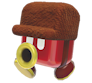
> {: .float-right-desktop }
> From *Super Mario 3D World*{: .italic }  
>
> Blocksteppers are nothing if not team players. Always marching at least in pairs, you'd be hard pressed to find a blockstepper without at least one staunch ally by their side.
>
> ***+1 Heart**{: .heart-color }, **+1 Courage**{: .courage-color }*{: .text-gamma .header-font }  
> *1 Power, 0 Defense*{: .text-gamma .header-font }  
>
> {: .specie-pros-callout }
> > *Pros*{: .text-gamma .header-font }  
> > *+ Coordination (Marching)*{: .heart-color }  
> > *+ Notice (Hiding)*{: .spirit-color }  
> > *+ Cheer (Rally Together)*{: .courage-color } 
>
> {: .specie-cons-callout }
> > *Cons*{: .text-gamma .header-font }  
> > Handless
>
> {: .specie-inner-callout }
> > *Tech Defaults*{: .text-gamma .header-font }  
> >
> > Boost (Any)  
> > *Minion (Blocksteppers)*{: .alt-grey-line }  
> > Repeat  
> > *Shared*{: .alt-grey-line }  
> >
>

{: .specie-callout }
> ## Bonnetter
>
> 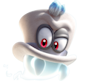
> {: .float-right-desktop }
> From *Super Mario Odyssey*{: .italic }  
>
> Bonnetters travel the world wide via airships of their likeness. They have an impeccable sense of fashion, and none would dare chastise a bonneeter's opinion on attire.  
>
> *Credit to **@deuceblitz**{: .courage-color } and **@lucydndprincess**{: .courage-color } on DIscord for help with the capture State.*{: .fs-3 }
>
> ***+1 Spirit**{: .spirit-color }*{: .text-gamma .header-font }  
> *1 Power, 0 Defense*{: .text-gamma .header-font }  
>
> {: .specie-pros-callout }
> > *Pros*{: .text-gamma .header-font }  
> > *+ Crafts (Vehicles)*{: .spirit-color }  
> > *or **+ Crafts (Headwar)**{: .spirit-color }*{: .mgl }  
> > *+ Knowhow (Style)*{: .spirit-color }  
> > *+ Persuade (Sales)*{: .courage-color }  
> > Hover
>
> {: .specie-cons-callout }
> > *Cons*{: .text-gamma .header-font }  
> > N/A
>
> {: .specie-inner-callout }
> > *Other Traits*{: .text-gamma .header-font }  
> > State (Capture)  
> > *By spending **2 FP**{: .spirit-color }, you can attempt to possess an enemy. This is considered a Charm technique that uses *Athletics*{: .heart-color }.*{: .mgl .fs-3 }  
> > *An enemy Charmed in this way takes your place in combat, and you must use your action to maintain the Charm. You can maintain this Charm for a number of turns per grade of success.*{: .mgl .fs-3 }  
> > ***Nice!**{: .nice-color }: 1 turn*{: .mgl-big .fs-3 }  
> > ***Great!**{: .great-color }: 2 turns*{: .mgl-big .fs-3 }  
> > ***Great!**{: .great-color }: 3 turns*{: .mgl-big .fs-3 }  
> > ***Wonderful!**{: .wonderful-color }: 4 turns*{: .mgl-big .fs-3 }  
> > ***Excellent!**{: .excellent-color }: 5 turns*{: .mgl-big .fs-3 }  
> > ***Unbelievable!**{: .unbelievable-color }: 6 turns*{: .mgl-big .fs-3 }  
>
> {: .specie-inner-callout }
> > *Tech Defaults*{: .text-gamma .header-font }  
> >
> > Aerial  
> > *Daze x2*{: .alt-grey-line }  
> > Disorient  
> > *Throw*{: .alt-grey-line }  
> >
>

{: .specie-callout }
> ## Bramball
>
> 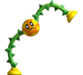
> {: .float-right-desktop }
> From *New Super Mario Bros. Wii*{: .italic }, *New Super Mario Bros. U*{: .italic }  
>
> The humble bramball strolls from place to place, not paying much mind to what's in its way, or where it's going. Many would describe a bramball as amicable, though not much for conversation, and being marvelous helps when in need of a quick pick-me-up.
>
> ***+1 Heart**{: .heart-color }, **+1 Spirit**{: .spirit-color }*{: .text-gamma .header-font }  
> *1 Power, 0 Defense*{: .text-gamma .header-font }  
>
> {: .specie-pros-callout }
> > *Pros*{: .text-gamma .header-font }  
> > *+ Coordination (Stomping)*{: .heart-color }  
> > *+ Knowhow (Flora)*{: .spirit-color }  
> > *+ Cheer (FP)*{: .courage-color }  
> > Contact  
> > *The attacker takes 1 damage, and you make a **Steady**{: .courage-color } check; the attacker is Dazed for 1 turn per Grade of Success.*{: .mgl .fs-3 }  
>
> {: .specie-cons-callout }
> > *Cons*{: .text-gamma .header-font }  
> > Handless  
> > Weakness (Aerial, Underfoot)  
> > *Aerial and Underfoot attacks ignore your Contact trait*{: .mgl .fs-3 }  
>
> {: .specie-inner-callout }
> > *Tech Defaults*{: .text-gamma .header-font }  
> >
> > Flowery  
> > *Overrun*{: .alt-grey-line }  
> > Piercing  
> > *Selective, Indirect*{: .alt-grey-line }  
> >
>

{: .specie-callout }
> ## Brock
>
> 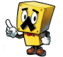
> {: .float-right-desktop }
> From *Mario & Luigi: Bowser's Inside Story*{: .italic }, *Mario & Luigi: Dream Team*{: .italic }  
>
> Brocks are best described as hardy and astute. Even the most humble of brocks know how to pitch a product. As such, many do work as merchants and salesmen, and have the bulk to keep their wares safe. 
>
> ***+1 Heart**{: .heart-color }, **+1 Courage**{: .courage-color }*{: .text-gamma .header-font }  
> *1 Power, 1 Defense*{: .text-gamma .header-font }  
>
> {: .specie-pros-callout }
> > *Pros*{: .text-gamma .header-font }  
> > *+ Guard (Ranged)*{: .heart-color }  
> > *+ Persuade (Sales)*{: .courage-color }  
> > *+ Steady (Etiquette)*{: .courage-color }  
> > 1 Resist (Ranged)  
> > \+ ½ starting coins
>
> {: .specie-cons-callout }
> > *Cons*{: .text-gamma .header-font }  
> > Weakness (Underfoot)  
> > *You are Dazed (1) for a number of turns equal to the damage dealt, and lose 1 coin.*{: .mgl .fs-3 }  
>
> {: .specie-inner-callout }
> > *Tech Defaults*{: .text-gamma .header-font }  
> >
> > Alternative (Coins)  
> > *Boost (Defense)*{: .alt-grey-line }  
> > Charm  
> > *Hearty x2*{: .alt-grey-line }  
> >
>

{: .specie-callout }
> ## Broodal
>
> 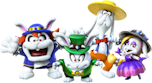
> {: .float-right-desktop }
> From *Super Mario Odyssey*{: .italic }  
>
> These brutal snobs come from the moon, and hold a reputation for their excellent sense of fashion and decor. Their bark can be just as bad, if not worse, than their bite. And a broodal would NEVER be caught dead without a stylish outfit, armed to the teeth with weaponry.
>
> ***+1 Heart**{: .heart-color }, **+1 Courage**{: .courage-color }*{: .text-gamma .header-font }  
> *1 Power, 0 Defense*{: .text-gamma .header-font }  
>
> {: .specie-pros-callout }
> > *Pros*{: .text-gamma .header-font }  
> > *+ Athletics (Jump)*{: .heart-color }  
> > *+ Knowhow (High Society)*{: .spirit-color }  
> > *+ Steady (Etiquette)*{: .courage-color }  
>
> {: .specie-cons-callout }
> > *Cons*{: .text-gamma .header-font }  
> > N/A
>
> {: .specie-inner-callout }
> > *Tech Defaults*{: .text-gamma .header-font }  
> >
> > Aerial  
> > *Repeat*{: .alt-grey-line }  
> > Sequential  
> > *Tool (Ranged)*{: .alt-grey-line }  
> >
>

{: .specie-callout }
> ## Bubblainian
>
> 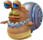
> {: .float-right-desktop }
> From *Super Mario Odyssey*{: .italic }  
>
> These laid-back gastropods are all about one thing: taking it easy. Relaxation is the motto of the bubblainians, and if something comes to disturb their peace, then they'll put together all their resources to return things to a carefree calm.
>
> ***+2 Courage**{: .courage-color }*{: .text-gamma .header-font }  
> *1 Power, 1 Defense*{: .text-gamma .header-font }  
>
> {: .specie-pros-callout }
> > *Pros*{: .text-gamma .header-font }  
> > *+ Athletics (Guard)*{: .heart-color }  
> > *+ Cheer (Relaxation)*{: .courage-color }  
> > *+ Perform (Instruments)*{: .courage-color }  
> > Aquatic
>
> {: .specie-cons-callout }
> > *Cons*{: .text-gamma .header-font }  
> > Weakness (Earth)  
> > *You take +2 damage and become Dazed (1) for a number of turns equal to the damage taken.*{: .mgl .fs-3 }  
>
> {: .specie-inner-callout }
> > *Tech Defaults*{: .text-gamma .header-font }  
> >
> > Allies  
> > *Boost (Defense)*{: .alt-grey-line }  
> > Charm  
> > *Flowery*{: .alt-grey-line }  
> >
>

{: .specie-callout }
> ## Cataquack
>
> 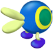
> {: .float-right-desktop }
> From *Super Mario Sunshine*{: .italic }  
>
> Cataquacks live idle lives, primarily on the beaches of tropical vistas. Notably, the closer their coloration is to red, the more aggressive they tend to be. Otherwise, they don"t often go looking for trouble, unless it brings itself to their proverbial front door.
>
> ***+2 Heart**{: .heart-color }*{: .text-gamma .header-font }  
> *1 Power, 0 Defense*{: .text-gamma .header-font }  
>
> {: .specie-pros-callout }
> > *Pros*{: .text-gamma .header-font }  
> > *+ Athletics (Run)*{: .heart-color }  
> > *+ Athletics (Flipping)*{: .heart-color }  
> > *+ Bully (Shove)*{: .courage-color }  
>
> {: .specie-cons-callout }
> > *Cons*{: .text-gamma .header-font }  
> > Handless  
> > Weakness (Water)  
> > *You are flipped over, Dazed (1) for a number of turns equal to the damage dealt.*{: .mgl .fs-3 }
>
> {: .specie-inner-callout }
> > *Tech Defaults*{: .text-gamma .header-font }  
> >
> > Launch  
> > *Sequential*{: .alt-grey-line }  
> > Throw  
> > *Underfoot*{: .alt-grey-line }  
> >
>

{: .specie-callout }
> ## Coconutter
>
> 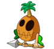
> {: .float-right-desktop }
> From *Mario & Luigi: Partners in Time*{: .italic }  
>
> Coconutters live deep in jungles and tropics, fostering and growing nature around them. They don"t often take kindly to trespassers!  
> Credit to “Fernikart57” on DeviantArt for the art.
>
> ***+1 Heart**{: .heart-color }, **+1 Spirit**{: .spirit-color }*{: .text-gamma .header-font }  
> *1 Power, 0 Defense*{: .text-gamma .header-font }  
>
> {: .specie-pros-callout }
> > *Pros*{: .text-gamma .header-font }  
> > *+ Crafts (Tools)*{: .spirit-color }  
> > *+ Knowhow (Nature)*{: .spirit-color }  
> > *+ Perform (Chanting)*{: .courage-color }  
>
> {: .specie-cons-callout }
> > *Cons*{: .text-gamma .header-font }  
> > Weakness (Fire)  
> > *You take +2 damage and suffer from a Lingering burn, lasting a number of turns equal to the damage taken.*{: .mgl .fs-3 }
>
> {: .specie-inner-callout }
> > *Tech Defaults*{: .text-gamma .header-font }  
> >
> > Hearty x2  
> > *Lingering (Poison)*{: .alt-grey-line }  
> > Terrain (Rain)  
> > *Tool*{: .alt-grey-line }  
> >
>

{: .specie-callout }
> ## Cragnon
>
> 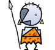
> {: .float-right-desktop }
> From *Super Paper Mario*{: .italic }  
>
> These technologically advanced cavemen have an odd way of speaking. Though their speech isn't as intriguing as their Cragnology. Being masters of influencing rock to carry messages and signals, they've created a variety of programs to entertain themselves when not on the hunt.
>
> ***+1 Heart**{: .heart-color }, **+1 Courage**{: .courage-color }*{: .text-gamma .header-font }  
> *1 Power, 0 Defense*{: .text-gamma .header-font }  
>
> {: .specie-pros-callout }
> > *Pros*{: .text-gamma .header-font }  
> > *+ Coordination (Weapons)*{: .heart-color }  
> > *+ Knowhow (Rocks)*{: .spirit-color }  
> > *or **+ Knowhow (Tracking)**{: .spirit-color }*{: .mgl }  
> > *+ Perform (Acting)*{: .courage-color }
>
> {: .specie-cons-callout }
> > *Cons*{: .text-gamma .header-font }  
> > N/A
>
> {: .specie-inner-callout }
> > *Tech Defaults*{: .text-gamma .header-font }  
> >
> > Boost (Defense)  
> > *Daze x2*{: .alt-grey-line }  
> > Strike-Through  
> > *Tool*{: .alt-grey-line }  
> >
>

{: .specie-callout }
> ## Emoglobin
> 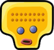
> {: .float-right-desktop }
> From *Mario & Luigi: Bowser's Inside Story*{: .italic }  
>
> Emoglobin are bizarre little antibodies that typically take up important functions in one's body. How they gain larger size, and how they escape their host bodies, is greatly unknown. What is known is that they excel at using their restorative properties to aid those around them. Just.. don’t ask where its healing comes from.
>
> ***+2 Heart**{: .heart-color }*{: .text-gamma .header-font }  
> *0 Power, 0 Defense*{: .text-gamma .header-font }  
>
> {: .specie-pros-callout }
> > *Pros*{: .text-gamma .header-font }  
> > *+ Heal (First Aid)*{: .heart-color }  
> > *+ Knowhow (Biology)*{: .spirit-color }  
> > *+ Steady (VS Status)*{: .courage-color }  
> > Hover  
> > Efficient (*First Aid*{: .heart-color })
>
> {: .specie-cons-callout }
> > *Cons*{: .text-gamma .header-font }  
> > Handless
>
> {: .specie-inner-callout }
> > *Tech Defaults*{: .text-gamma .header-font }  
> >
> > All  
> > *Boost*{: .alt-grey-line }  
> > Dismiss  
> > *Hearty x2*{: .alt-grey-line }  
> >
>

{: .specie-callout }
> ## Fronk (WIP)
>
> 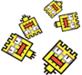
> {: .float-right-desktop }
> A description of the Species and how they fit into the world. These descriptions are simple and general, and do not define individual members of their Species.
>
> *Stat Modifiers*{: .text-gamma .header-font }  
> *1 Power, 0 Defense*{: .text-gamma .header-font }  
>
> {: .specie-pros-callout }
> > *Pros*{: .text-gamma .header-font }  
> > The Skill Specialisations and other Traits that make denizens of that Species more capable.  
> > *Some Traits, like Immune, will be described in more detail like this.*{: .mgl .fs-3 }
>
> {: .specie-cons-callout }
> > *Cons*{: .text-gamma .header-font }  
> > The Traits that a character of that Species have to deal with that are generally less desirable.  
> > *Some Traits, like Weakness, will be described in more detail like this.*{: .mgl .fs-3 }
>
> {: .specie-inner-callout }
> > *Other Traits*{: .text-gamma .header-font }  
> > Any other qualities the species has that may not fit neatly into a Pro or a Con go here in one large block underneath Pros and Cons.  
> > Most often this is for Species with a State Trait, which grants them contextual bonuses/penalties.
>
> {: .specie-inner-callout }
> > *Tech Defaults*{: .text-gamma .header-font }  
> >
> > Example Tech 1  
> > *Example Tech 2*{: .alt-grey-line }  
> > Example Tech 3  
> > *Example Tech 2*{: .alt-grey-line }  
> >
> > Any *Required*{: .underlined } or *Optional*{: .underlined } effects are listed underneath, and can (or must) be taken in addition to Tech Defaults.
>

{: .specie-callout }
> ## Fake Block
>
> 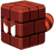
> {: .float-right-desktop }
> From *Super Mario 3D Land*{: .italic }  
>
> Sometimes, a block containing a power-up becomes suffused with the power in the item. This gives the block a spark of life, allowing it to move and use its powers to its own benefit.
>
> ***+2 Courage**{: .courage-color }*{: .text-gamma .header-font }  
> *1 Power, 0 Defense*{: .text-gamma .header-font }  
>
> {: .specie-pros-callout }
> > *Pros*{: .text-gamma .header-font }  
> > *+ Crafts (Power-Ups)*{: .spirit-color }  
> > *+ Trickery (Blend In)*{: .spirit-color }  
> > *+ Steady (Power-Ups)*{: .courage-color }  
> > Start with one Power-Up or Item worth 50 Coins or less  
> > Latent (Chosen Item/Power-Up)  
> > *For **5 FP**{: .spirit-color }: Activate the effect of your chosen Power-Up or Item (in the case of the Power-Up, you have to target yourself)*{: .mgl .fs-3 }
>
> {: .specie-cons-callout }
> > *Cons*{: .text-gamma .header-font }  
> > Handless  
> > Weakness (Underfoot)  
> > *You are Dazed (1) for a number of turns equal to the damage dealt, and you lose your active power-up if you have one.*{: .mgl .fs-3 }
>
> {: .specie-inner-callout }
> > *Tech Defaults*{: .text-gamma .header-font }  
> >
> > Aerial  
> > *Snatch*{: .alt-grey-line }  
> >
> > *Two of the following*{: .underlined }:  
> > Counter  
> > *Lingering x2*{: .alt-grey-line }  
> > Indirect, Element (Any, related to chosen Power-Up or Item)  
> > *Ranged, Element (Any, related to chosen Power-Up or Item)*{: .alt-grey-line }  
> > Aquatic, Carrier, or Hover (as a Personal Trait)
> >
>

{: .specie-callout }
> ## Gearmo
>
> 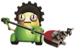
> {: .float-right-desktop }
> From *Super Mario Galaxy*{: .italic }  
>
> Gearmos are autonomous janitors, most well equipped for the care and maintenance of machinery. They can be very particular with keeping things clean, and are easily irked when things make their jobs harder.
>
> ***+1 Spirit**{: .spirit-color }, **+1 Courage**{: .courage-color }*{: .text-gamma .header-font }  
> *1 Power, 0 Defense*{: .text-gamma .header-font }  
>
> {: .specie-pros-callout }
> > *Pros*{: .text-gamma .header-font }  
> > *+ Crafts (Maintenance)*{: .spirit-color }  
> > *+ Knowhow (Machinery)*{: .spirit-color }  
> > *+ Bully (Chiding)*{: .courage-color }  
> > Construct (Lifelike)  
> > 1 Resist (Blast)
>
> {: .specie-cons-callout }
> > *Cons*{: .text-gamma .header-font }  
> > Weakness (Shock)  
> > *You become Dazed (1), lasting for a number of turns equal to the damage taken.*{: .mgl .fs-3 }
>
> {: .specie-inner-callout }
> > *Tech Defaults*{: .text-gamma .header-font }  
> >
> > Disable  
> > *Homing*{: .alt-grey-line }  
> > Swap x2  
> > *Tool (Built-In)*{: .alt-grey-line }  
> >
>

{: .specie-callout }
> ## Gooble
>
> 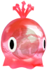
> {: .float-right-desktop }
> From *Super Mario Sunshine*{: .italic }  
>
> Goobles come in all colors of the rainbow. Being made of paint, they have a knack for creativity that goes into everything they do.
>
> ***+1 Heart**{: .heart-color }, **+1 Courage**{: .courage-color }*{: .text-gamma .header-font }  
> *1 Power, 0 Defense*{: .text-gamma .header-font }  
>
> {: .specie-pros-callout }
> > *Pros*{: .text-gamma .header-font }  
> > *+ Athletics (Leaping)*{: .heart-color }  
> > *+ Crafts (Painting)*{: .spirit-color }  
> > *+ Bully (Poison)*{: .courage-color }  
> > Clones (Copies)  
> > Immune (Poison)  
> > *You heal **5 HP**{: .heart-color } instead.*{: .mgl .fs-3 }
>
> {: .specie-cons-callout }
> > *Cons*{: .text-gamma .header-font }  
> > Handless  
> > Weakness (Water)  
> > *You take double damage. If this Technique wouldn't usually deal damage, it deals 2 Piercing damage. Your Attack is Weakened (1) for a number of turns equal to the damage taken.*{: .mgl .fs-3 }
>
> {: .specie-inner-callout }
> > *Tech Defaults*{: .text-gamma .header-font }  
> >
> > Drain x2  
> > *Lingering x2*{: .alt-grey-line }  
> > Spillover  
> > *Terrain (Goop)*{: .alt-grey-line }  
> >
> > *Optional*{: .underlined }: Element (Poison) on Indirect or Ranged Techniques
>

{: .specie-callout }
> ## Gotchawrench
>
> 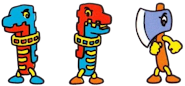
> {: .float-right-desktop }
> From *Wrecking Crew*{: .italic }  
>
> These malignant tools are what happens when a tool goes for too long without use, growing resentful and finding use for themselves. Often, this leads to them causing trouble in order to make problems for them to fix. Despite the name, Gotchawrenches can take the form of most any hardware tool.
>
> ***+2 Heart**{: .heart-color }*{: .text-gamma .header-font }  
> *1 Power, 0 Defense*{: .text-gamma .header-font }  
>
> {: .specie-pros-callout }
> > *Pros*{: .text-gamma .header-font }  
> > *+ Athletics (Demolition)*{: .heart-color }  
> > *+ Crafts (Construction)*{: .spirit-color }  
> > *or **+ Crafts (Jury-Rig)**{: .spirit-color }*{: .mgl }  
> > *+ Trickery (Stealth)*{: .spirit-color }  
> > Construct (Lifelike)
>
> {: .specie-cons-callout }
> > *Cons*{: .text-gamma .header-font }  
> > N/A
>
> {: .specie-inner-callout }
> > *Tech Defaults*{: .text-gamma .header-font }  
> >
> > Daze x2  
> > *Piercing*{: .alt-grey-line }  
> > Quake  
> > *Tool (Built-In)*{: .alt-grey-line }  
> >
>

{: .specie-callout }
> ## Gushen
>
> 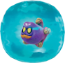
> {: .float-right-desktop }
> From *Super Mario Odyssey*{: .italic }  
>
> Gushen are haughty sea creatures, priding themselves on their speed and their 'staches.
>
> ***+1 Heart**{: .heart-color }, **+1 Courage**{: .courage-color }*{: .text-gamma .header-font }  
> *1 Power, 0 Defense*{: .text-gamma .header-font }  
>
> {: .specie-pros-callout }
> > *Pros*{: .text-gamma .header-font }  
> > *+ Athletics (Propel)*{: .heart-color }  
> > *+ Aim (Spray)*{: .heart-color }  
> > *+ Poise (Etiquette)*{: .courage-color }  
> > Aquatic 
> > Fly
> > *You cannot use your fly if you do not have access to water.*{: .mgl .fs-3 }
>
> {: .specie-cons-callout }
> > *Cons*{: .text-gamma .header-font }  
> > Handless
>
> {: .specie-inner-callout }
> > *Tech Defaults*{: .text-gamma .header-font }  
> >
> > Element (Water)  
> > *Provoke x2*{: .alt-grey-line }  
> > Ranged  
> > *Spillover*{: .alt-grey-line }  
> >
> > *Optional*{: .underlined }: Element (Water) on Indirect or Ranged attacks
>

{: .specie-callout }
> ## Honeybee
>
> 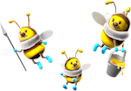
> {: .float-right-desktop }
> From *Super Mario Galaxy*{: .italic }  
>
> Honeybees live out fulfilling lives creating honey for their colony, and carrying out the will of their queen. Some may leave their colonies to act as emissaries of their kingdom, or to see what the wider world holds for them.
>
> ***+2 Courage**{: .courage-color }*{: .text-gamma .header-font }  
> *1 Power, 0 Defense*{: .text-gamma .header-font }  
>
> {: .specie-pros-callout }
> > *Pros*{: .text-gamma .header-font }  
> > *+ Heal (Honey)*{: .heart-color }  
> > *+ Trickery (Dodge)*{: .spirit-color }  
> > *+ Steady (Orderly)*{: .courage-color }  
> > Fly
>
> {: .specie-cons-callout }
> > *Cons*{: .text-gamma .header-font }  
> > N/A
>
> {: .specie-inner-callout }
> > *Tech Defaults*{: .text-gamma .header-font }  
> >
> > Aerial  
> > *Flowery*{: .alt-grey-line }  
> > Lingering x2 (Poison)  
> > *Strike-Through x2*{: .alt-grey-line }  
> >
>

{: .specie-callout }
> ## Jibberjay
>
> 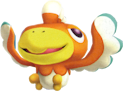
> {: .float-right-desktop }
> These loud-mouthed avians live for the thrill of competition. They make their homes in jungles, where they can find challenging places to race each other.
>
> ***+2 Courage**{: .courage-color }*{: .text-gamma .header-font }  
> *1 Power, 0 Defense*{: .text-gamma .header-font }  
>
> {: .specie-pros-callout }
> > *Pros*{: .text-gamma .header-font }  
> > *+ Athletics (Flying)*{: .heart-color }  
> > *+ Bully (Taunting)*{: .courage-color }  
> > *+ Perform (Stylish Moves)*{: .courage-color }  
> > Fly
>
> {: .specie-cons-callout }
> > *Cons*{: .text-gamma .header-font }  
> > N/A
>
> {: .specie-inner-callout }
> > *Tech Defaults*{: .text-gamma .header-font }  
> >
> > Aerial  
> > *Boost (Dodge)*{: .alt-grey-line }  
> > Disable x2  
> > *Disorient*{: .alt-grey-line }  
> >
>

{: .specie-callout }
> ## Li'l Oink
>
> 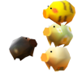
> {: .float-right-desktop }
> From *Paper Mario*{: .italic }  
>
> These bespeckled pigs are skittish little things, though are beloved by all for their patterns. They are creatures of chance, happening upon places and things they generally shouldn't.  
>
> *Created by **@lonelyazalea**{: .courage-color }*{: .fs-3 }
>
> ***+1 Heart**{: .heart-color }, **+1 Courage**{: .courage-color }*{: .text-gamma .header-font }  
> *1 Power, 0 Defense*{: .text-gamma .header-font }  
>
> {: .specie-pros-callout }
> > *Pros*{: .text-gamma .header-font }  
> > *+ Athletics (Fleeing)*{: .heart-color }  
> > *+ Notice (Movement)*{: .spirit-color }  
> > *+ Perform (Cuteness)*{: .courage-color }  
> > Immune (Confusion)
>
> {: .specie-cons-callout }
> > *Cons*{: .text-gamma .header-font }  
> > Handless
>
> {: .specie-inner-callout }
> > *Tech Defaults*{: .text-gamma .header-font }  
> >
> > All, Confuse  
> > *Roulette (**-2 FP**{: .spirit-color } on each Roulette Slot)*{: .alt-grey-line }  
> > Lucky Hit, Fumble (-4 FP on the Lucky Slot)  
> > *Coin Toss (**-3 FP**{: .spirit-color } on each Coin Slot)*{: .alt-grey-line }  
> >
>

{: .specie-callout }
> ## Mister I
>
> 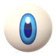
> {: .float-right-desktop }
> From *Super Mario 64*{: .italic }  
>
> Mister Is are incredibly odd beings, being large floating eyeballs. Their disconcerting gaze is described as disturbing by some, and hypnotic by others. Usually, though, you can find them just.. float there.
>
> ***+2 Spirit**{: .spirit-color }*{: .text-gamma .header-font }  
> *1 Power, 0 Defense*{: .text-gamma .header-font }  
>
> {: .specie-pros-callout }
> > *Pros*{: .text-gamma .header-font }  
> > *+ Notice (Observations)*{: .spirit-color }  
> > *+ Notice (Secrets)*{: .spirit-color }  
> > *+ Bully (Unnerve)*{: .courage-color }  
> > Hover
>
> {: .specie-cons-callout }
> > *Cons*{: .text-gamma .header-font }  
> > Handless  
> > Weakness (Disoriented)  
> > *The Level and Duration of any Disoriented inflicted on you is doubled.*{: .mgl .fs-3 }
>
> {: .specie-inner-callout }
> > *Tech Defaults*{: .text-gamma .header-font }  
> >
> > Confuse x2  
> > *Fear x2*{: .alt-grey-line }  
> > Homing  
> > *Ranged*{: .alt-grey-line }  
> >
>

{: .specie-callout }
> ## New Donker
>
> 
> {: .float-right-desktop }
> From *Super Mario Odyssey*{: .italic }  
>
> Most New Donkers are just trying to get by. They're usually no-nonsense, but see the importance of taking time to wind down from work.
>
> ***+1 Spirit**{: .spirit-color }, **+1 Courage**{: .courage-color }*{: .text-gamma .header-font }  
> *1 Power, 0 Defense*{: .text-gamma .header-font }  
>
> {: .specie-pros-callout }
> > *Pros*{: .text-gamma .header-font }  
> > *+ Knowhow (Any one job, chosen at character creation)*{: .spirit-color }  
> > *+ Trickery (Join the Crowd)*{: .spirit-color }  
> > *+ Perform (Modern Hits)*{: .courage-color }  
>
> {: .specie-cons-callout }
> > *Cons*{: .text-gamma .header-font }  
> > N/A
>
> {: .specie-inner-callout }
> > *Tech Defaults*{: .text-gamma .header-font }  
> >
> > Alternative (Coins)  
> > *Tool*{: .alt-grey-line }  
> >
> > 1x Custom Set of Traits  
> > Custom Sets are defined during character creation. For New Donkers, they can include any Traits totalling no more than **2 FP**{: .spirit-color }, and can't include negative Traits.
> >
>

{: .specie-callout }
> ## Pi'illo
>
> 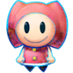
> {: .float-right-desktop }
> From *Mario & Luigi: Dream Team*{: .italic }  
>
> The Pi'illo are an ancient people, hailing from Pi'illo Island. Though many are content to stay in their ancestral homes, the dreamy and longing nature of the Pi'illo folk lead them to travel beyond the island's shores. 
>
> ***+1 Spirit**{: .spirit-color }, **+1 Courage**{: .courage-color }*{: .text-gamma .header-font }  
> *1 Power, 0 Defense*{: .text-gamma .header-font }  
>
> {: .specie-pros-callout }
> > *Pros*{: .text-gamma .header-font }  
> > *+ Crafts (Bedwear)*{: .spirit-color }  
> > *+ Magic (Dreams)*{: .spirit-color }  
> > *+ Cheer (Inspire)*{: .courage-color }  
> > Hover  
> > Immune (Dazed)
>
> {: .specie-cons-callout }
> > *Cons*{: .text-gamma .header-font }  
> > Weakness (Sleep)  
> > *The Level and Duration of all statuses you suffer associated with sleep are doubled.*{: .mgl .fs-3 }
>
> {: .specie-inner-callout }
> > *Tech Defaults*{: .text-gamma .header-font }  
> >
> > Aerial  
> > *Daze x2*{: .alt-grey-line }  
> > Ranged  
> > *Tutor*{: .alt-grey-line }  
> >
>

{: .specie-callout }
> ## Pixl
>
> 
> {: .float-right-desktop }
> From *Super Paper Mario*{: .italic }  
>
> These geometric constructs were created from the spirits of the Game Overed by the shamans, fit into vessels for specific purposes. Though the means of their creation have been lost to all but the eldest of shamans, many still lie in wait in forgotten parts of the world.
>
> ***+1 Spirit**{: .spirit-color }, **+1 Courage**{: .courage-color }*{: .text-gamma .header-font }  
> *1 Power, 0 Defense*{: .text-gamma .header-font }  
>
> {: .specie-pros-callout }
> > *Pros*{: .text-gamma .header-font }  
> > *+ Knowhow (Ancient Lore)*{: .spirit-color }  
> > *+ Magic (Skill Substitution)*{: .spirit-color }  
> > *+ Cheer (Assist)*{: .courage-color }  
> > Construct (Lifelike)  
> > Fly
>
> {: .specie-cons-callout }
> > *Cons*{: .text-gamma .header-font }  
> > Handless
>
> {: .specie-inner-callout }
> > *Tech Defaults*{: .text-gamma .header-font }  
> >
> > Boost (Any)  
> > *Hustle, Others*{: .alt-grey-line }  
> > Tool (Built-In)  
> > *Tutor*{: .alt-grey-line }  
> >
>

{: .specie-callout }
> ## Portrait Ghost
>
> 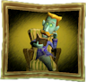
> {: .float-right-desktop }
> From *Luigi's Mansion*{: .italic }  
>
> Portrait ghosts come from portraits of people who've died. They'll often become a mimicry of the person they were painted after, partaking in jobs and routines that the subject did in life.
>
> ***+2 Spirit**{: .spirit-color }*{: .text-gamma .header-font }  
> *1 Power, 0 Defense*{: .text-gamma .header-font }  
>
> {: .specie-pros-callout }
> > *Pros*{: .text-gamma .header-font }  
> > *+ Athletics (Telekinesis)*{: .heart-color }  
> > *+ Knowhow (Any, defined at character creation)*{: .spirit-color }  
> > *+ Trickery (Dodge)*{: .spirit-color }  
> > Hover  
> > Immune (Fear, Poison)  
> > Intangible  
> > Undead (Lifelike)
>
> {: .specie-cons-callout }
> > *Cons*{: .text-gamma .header-font }  
> > Weakness (Sudden Light)  
> > *You are stunned by the light, Dazing (1) you for a turn for each point of damage taken (minimum 1 turn).*{: .mgl .fs-3 }  
>
> {: .specie-inner-callout }
> > *Tech Defaults*{: .text-gamma .header-font }  
> >
> > Drain  
> > *Fear x2*{: .alt-grey-line }  
> > Launch  
> > *Throw*{: .alt-grey-line }  
> >
>

{: .specie-callout }
> ## Sammer Guy
>
> 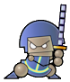
> {: .float-right-desktop }
> From *Super Paper Mario*{: .italic }  
>
> These valiant warriors come from the Sammer Kingdom. Each lives by their own personal code of honor, often finding work as mercenaries. But each guy fights for two things above all: glory for themselves, and for the Sammer Kingdom.
>
> ***+2 Heart**{: .heart-color }*{: .text-gamma .header-font }  
> *1 Power, 1 Defense*{: .text-gamma .header-font }  
>
> {: .specie-pros-callout }
> > *Pros*{: .text-gamma .header-font }  
> > *+ Coordination (Acrobatics)*{: .heart-color }  
> > *+ Guard (Melee)*{: .heart-color }  
> > *+ Bully (Intimidate)*{: .courage-color }  
>
> {: .specie-cons-callout }
> > *Cons*{: .text-gamma .header-font }  
> > N/A
>
> {: .specie-inner-callout }
> > *Tech Defaults*{: .text-gamma .header-font }  
> >
> > Counter  
> > *Fear x2*{: .alt-grey-line }  
> > Piercing  
> > *Tool (Indirect)*{: .alt-grey-line }  
> >
>

{: .specie-callout }
> ## Steam Gardener
>
> 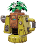
> {: .float-right-desktop }
> From *Super Mario Odyssey*{: .italic }  
>
> Gardening automatons who call the Wooded Kingdom home. Gardeners will often go on pilgrimages to distant lands to learn about new plants, and bring seeds back to their home.
>
> ***+1 Heart**{: .heart-color }, **+1 Spirit**{: .spirit-color }*{: .text-gamma .header-font }  
> *1 Power, 0 Defense*{: .text-gamma .header-font }  
>
> {: .specie-pros-callout }
> > *Pros*{: .text-gamma .header-font }  
> > *+ Aim (Watering)*{: .heart-color }  
> > *+ Crafts (Plants)*{: .spirit-color }  
> > *+ Knowhow (Flora)*{: .spirit-color }  
> > Construct (Lifelike)  
> > Sinker
>
> {: .specie-cons-callout }
> > *Cons*{: .text-gamma .header-font }  
> > N/A
>
> {: .specie-inner-callout }
> > *Tech Defaults*{: .text-gamma .header-font }  
> >
> > Dismiss  
> > *Flowery*{: .alt-grey-line }  
> > Ranged  
> >
> > *Optional*{: .underlined }: Element (Water) on Ranged attacks
>

{: .specie-callout }
> ## Shiverian
>
> 
> {: .float-right-desktop }
> From *Super Mario Odyssey*{: .italic }  
>
> These racers are as cheerful as their bodies are dense. Their thick fat helps them maneuver around without much use of their tiny legs, and helps them to protect what they care about. They adore friendly competition, and you'd be hard pressed to find a shiverian who backs down from a challenge.
>
> ***+2 Heart**{: .heart-color }*{: .text-gamma .header-font }  
> *1 Power, 0 Defense*{: .text-gamma .header-font }  
>
> {: .specie-pros-callout }
> > *Pros*{: .text-gamma .header-font }  
> > *+ Athletics (Bouncing)*{: .heart-color }  
> > *+ Guard (Melee)*{: .heart-color }  
> > *+ Steady (Balance)*{: .courage-color }  
> > 1 Resist (Ice)
>
> {: .specie-cons-callout }
> > *Cons*{: .text-gamma .header-font }  
> > N/A
>
> {: .specie-inner-callout }
> > *Tech Defaults*{: .text-gamma .header-font }  
> >
> > Aerial  
> > *Counter, Harmless*{: .alt-grey-line }  
> > Disorient  
> > *Stun*{: .alt-grey-line }  
> >
> > *Optional*{: .underlined }: Element (Ice) on Indirect attacks
>

{: .specie-callout }
> ## Shroob
>
> 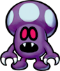
> {: .float-right-desktop }
> From *Mario & Luigi: Partners in Time*{: .italic }  
>
> Shroobs were once a race of fearsome aliens from Planet Shroob. Now, they've faced near extinction. The shroobs who still remain are just as shrewd and intelligent as their forefathers, and may one day seek to rise for another takeover. For now, though, they're content to be just as they are.
>
> ***+1 Heart**{: .heart-color }, **+1 Spirit**{: .spirit-color }*{: .text-gamma .header-font }  
> *1 Power, 0 Defense*{: .text-gamma .header-font }  
>
> {: .specie-pros-callout }
> > *Pros*{: .text-gamma .header-font }  
> > *+ Aim (Rays)*{: .heart-color }  
> > *+ Crafts (Gadgets)*{: .spirit-color }  
> > *+ Knowhow (Biology)*{: .spirit-color }
>
> {: .specie-cons-callout }
> > *Cons*{: .text-gamma .header-font }  
> > N/A
>
> {: .specie-inner-callout }
> > *Tech Defaults*{: .text-gamma .header-font }  
> >
> > Minion (RC Drones)  
> > *Tool (Ranged)*{: .alt-grey-line }  
> > Variant (Crafts)  
> > *Weaken*{: .alt-grey-line }  
> >
>

{: .specie-callout }
> ## Tiki
>
> 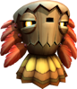
> {: .float-right-desktop }
> From *Donkey Kong Country Returns*{: .italic }  
>
> Tikis are a proud race of self-made, fruit fueled tribesmen. They possess great talent in music, which they often use to create disorienting and hypnotic songs to gain the upper hand.
>
> ***+1 Spirit**{: .spirit-color }, **+1 Courage**{: .courage-color }*{: .text-gamma .header-font }  
> *1 Power, 0 Defense*{: .text-gamma .header-font }  
>
> {: .specie-pros-callout }
> > *Pros*{: .text-gamma .header-font }  
> > *+ Crafts (Woodworking)*{: .spirit-color }  
> > *+ Magic (Hypnotism)*{: .spirit-color }  
> > *+ Perform (Music)*{: .courage-color }  
> > Construct (Lifelike)  
> > Hover
>
> {: .specie-cons-callout }
> > *Cons*{: .text-gamma .header-font }  
> > Handless, or Weakness (Crushing)  
> > *You take +2 damage and fall to the ground. This leaves you Dazed (1) for a number of turns equal to the damage dealt.*{: .mgl .fs-3 }
>
> {: .specie-inner-callout }
> > *Tech Defaults*{: .text-gamma .header-font }  
> >
> > Charm  
> > *Confuse x2*{: .alt-grey-line }  
> > Disorient  
> > *Element (Fire)*{: .alt-grey-line }  
> >
>

{: .specie-callout }
> ## Topman
>
> 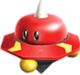
> {: .float-right-desktop }
> From *Super Mario Galaxy*{: .italic }  
>
> Topmen are a tribe of spacefaring robots, constantly seeking territory. They often settle clashes by crashing into each other, seeing who falls first. Topmen are often honorable in the art of combat, using the bulk of their body to take down their foes.
>
> ***+1 Heart**{: .heart-color }, **+1 Courage**{: .courage-color }*{: .text-gamma .header-font }  
> *1 Power, 1 Defense*{: .text-gamma .header-font }  
>
> {: .specie-pros-callout }
> > *Pros*{: .text-gamma .header-font }  
> > *+ Athletics (Spinning)*{: .heart-color }  
> > *+ Bully (Knock Around)*{: .courage-color }  
> > *+ Steady (Balance)*{: .courage-color }  
> > Construct (Lifelike)  
> > Sinker
>
> {: .specie-cons-callout }
> > *Cons*{: .text-gamma .header-font }  
> > Weakness (Shock)  
> > *You take +2 damage and become Dazed (1) for a number of turns equal to the damage taken.*{: .mgl .fs-3 }
>
> {: .specie-inner-callout }
> > *Tech Defaults*{: .text-gamma .header-font }  
> >
> > Counter  
> > *Disorient*{: .alt-grey-line }  
> > Divider  
> > *Launch*{: .alt-grey-line }  
> >
>

{: .specie-callout }
> ## Tostarenan
>
> 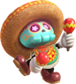
> {: .float-right-desktop }
> From *Super Mario Odyssey*{: .italic }  
>
> These fiesta loving skeletons call the sand kingdom home. Though when they leave the sands of Tostarena behind, they always bring the party with them.
>
> ***+2 Courage**{: .courage-color }*{: .text-gamma .header-font }  
> *1 Power, 0 Defense*{: .text-gamma .header-font }  
>
> {: .specie-pros-callout }
> > *Pros*{: .text-gamma .header-font }  
> > *+ Trickery (Parlour Tricks)*{: .spirit-color }  
> > *+ Cheer (Celebrations)*{: .courage-color }  
> > *+ Perform (Instruments)*{: .courage-color }  
> > Resilient  
> > Undead (Lifelike)
>
> {: .specie-cons-callout }
> > *Cons*{: .text-gamma .header-font }  
> > Weakness (Blast)  
> > *You take +2 damage and become Dazed (1) for a number of turns equal to the damage taken.*{: .mgl .fs-3 }
>
> {: .specie-inner-callout }
> > *Tech Defaults*{: .text-gamma .header-font }  
> >
> > Allies  
> > *Boost (Any)*{: .alt-grey-line }  
> > Charm  
> > *Dismiss*{: .alt-grey-line }  
> >
>

{: .specie-callout }
> ## Tox Box
>
> 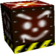
> {: .float-right-desktop }
> From *Super Mario 64*{: .italic }  
>
> Tox Boxes follow patterns their whole life, idly rolling about. Unless, of course, something stops them from completing their pattern, in which case they begin to wander around..
>
> ***+2 Heart**{: .heart-color }*{: .text-gamma .header-font }  
> *1 Power, 1 Defense*{: .text-gamma .header-font }  
>
> {: .specie-pros-callout }
> > *Pros*{: .text-gamma .header-font }  
> > *+ Athletics (Run Over)*{: .heart-color }  
> > *+ Guard (Melee)*{: .heart-color }  
> > *+ Bully (Knock Over)*{: .courage-color }  
> > Construct  
> > Sinker
>
> {: .specie-cons-callout }
> > *Cons*{: .text-gamma .header-font }  
> > Handless
>
> {: .specie-inner-callout }
> > *Tech Defaults*{: .text-gamma .header-font }  
> >
> > Daze x2  
> > *Overrun*{: .alt-grey-line }  
> > Secure, Others  
> > *Sequential*{: .alt-grey-line }  
> >
>

{: .specie-callout }
> ## Tsubōn
>
> 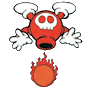
> {: .float-right-desktop }
> From *Mario & Wario*{: .italic }  
>
> These cursed urns often serve as mindless guards of caverns and temples. Though, there are a few among them who gain a heightened sense of self, setting out to find purpose in the world.
>
> ***+2 Heart**{: .heart-color }*{: .text-gamma .header-font }  
> *1 Power, 0 Defense*{: .text-gamma .header-font }  
>
> {: .specie-pros-callout }
> > *Pros*{: .text-gamma .header-font }  
> > *+ Aim (Projectiles)*{: .heart-color }  
> > *+ Athletics (Climbing)*{: .heart-color }  
> > *+ Crafts (Pottery)*{: .spirit-color }  
> > Construct (Lifelike)
>
> {: .specie-cons-callout }
> > *Cons*{: .text-gamma .header-font }  
> > Weakness (Launch/Throw)  
> > *If targeted by a move with the Launch or Thrown tags, your pottery cracks. You are Weakened (-1 POW) for a turn for each point of damage taken (minimum 1 turn).*{: .mgl .fs-3 }
>
> {: .specie-inner-callout }
> > *Tech Defaults*{: .text-gamma .header-font }  
> >
> > Ranged  
> > *Lingering x2*{: .alt-grey-line }  
> > Piercing  
> > *Repeat*{: .alt-grey-line }  
> >
> > *Optional*{: .underlined }: Element (Any) on Ranged attacks. (Must be decided at character creation)
>

{: .specie-callout }
> ## Twilighter
>
> 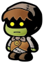
> {: .float-right-desktop }
> From *Paper Mario: The Thousand Year Door*{: .italic }  
>
> These shady folk prefer the darker corners of the world. Though their disposition may be gloomy, they're hardy survivors who will stand for the safety of friends and family. Though, they may just take the longer or less noticeable route to success.
>
> ***+2 Spirit**{: .spirit-color }*{: .text-gamma .header-font }  
> *1 Power, 0 Defense*{: .text-gamma .header-font }  
>
> {: .specie-pros-callout }
> > *Pros*{: .text-gamma .header-font }  
> > *+ Crafts (Stitching)*{: .spirit-color }  
> > *+ Trickery (Hiding)*{: .spirit-color }  
> > *+ Bully (Coerce)*{: .courage-color }  
> > Resilient
>
> {: .specie-cons-callout }
> > *Cons*{: .text-gamma .header-font }  
> > Weakness (Curses)  
> > *The duration of effects caused by curses are doubled.*{: .mgl .fs-3 }  
> > Weakness (Sudden Light)  
> > *You are stunned by the light, Dazing (1) you for a turn for each point of damage taken (minimum 1 turn).*{: .mgl .fs-3 }  
>
> {: .specie-inner-callout }
> > *Tech Defaults*{: .text-gamma .header-font }  
> >
> > Daze x2  
> > *Repeat*{: .alt-grey-line }  
> > Snatch  
> > *Terrain (Darkness)*{: .alt-grey-line }  
> >
> > *Optional*{: .underlined }: Element (Shadow) on Indirect or Ranged Techniques
>

{: .specie-callout }
> ## Uproot
>
> 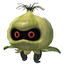
> {: .float-right-desktop }
> From *Super Mario Odyssey*{: .italic }  
>
> Uproots dwell in deep forests, creating shells to protect themselves from the elements. Weirdly enough, the shells they make often resemble plant pots..
>
> ***+2 Heart**{: .heart-color }*{: .text-gamma .header-font }  
> *1 Power, 0 Defense*{: .text-gamma .header-font }  
>
> {: .specie-pros-callout }
> > *Pros*{: .text-gamma .header-font }  
> > *+ Athletics (Jumping)*{: .heart-color }  
> > *+ Guard (Melee)*{: .heart-color }  
> > *+ Crafts (Ceramics)*{: .spirit-color }  
> > Elevation
>
> {: .specie-cons-callout }
> > *Cons*{: .text-gamma .header-font }  
> > N/A
>
> {: .specie-inner-callout }
> > *Tech Defaults*{: .text-gamma .header-font }  
> >
> > Aerial  
> > *Indirect*{: .alt-grey-line }  
> > Reach  
> > *Repeat*{: .alt-grey-line }  
> >
>

{: .specie-callout }
> ## Virus
>
> 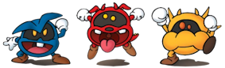
> {: .float-right-desktop }
> From *Dr. Mario*{: .italic }  
>
> Viruses are naughty little creatures, most often set to inflict their ails on whoever they come across. Even so, when faced with threats much greater than one of their own, their camaraderie is second to none, joining forces to take on tough foes.
>
> ***+1 Spirit**{: .spirit-color }, **+1 Courage**{: .courage-color }*{: .text-gamma .header-font }  
> *1 Power, 0 Defense*{: .text-gamma .header-font }  
>
> {: .specie-pros-callout }
> > *Pros*{: .text-gamma .header-font }  
> > *+ Knowhow (Medicine)*{: .spirit-color }  
> > *+ Trickery (Shenanigans)*{: .spirit-color }  
> > *+ Bully (Weaken)*{: .courage-color }  
> > Clone (Copies)
>
> {: .specie-cons-callout }
> > *Cons*{: .text-gamma .header-font }  
> > Weakness (Life Magic, Medicine)  
> > *You treat the **HP**{: .heart-color } you would normally recover as damage.*{: .mgl .fs-3 }
>
> {: .specie-inner-callout }
> > *Tech Defaults*{: .text-gamma .header-font }  
> >
> > Confuse x2  
> > *Disable x2*{: .alt-grey-line }  
> > Lingering x2 (Sickness)  
> > *Weaken*{: .alt-grey-line }  
> >
>

{: .specie-callout }
> ## Volbonan
>
> 
> {: .float-right-desktop }
> From *Super Mario Odyssey*{: .italic }  
>
> These expert chefs call the Luncheon Kingdom home. The travelers amongst them are always searching for new flavors for their dishes, and new meals to sample. Wherever a Volbonan goes, tasty food is sure to follow.  
>
> *Credit to "Lwiis64" on DeviantArt for the art.*{: .fs-3 }  
>
> ***+1 Heart**{: .heart-color }, **+1 Spirit**{: .spirit-color }*{: .text-gamma .header-font }  
> *1 Power, 0 Defense*{: .text-gamma .header-font }  
>
> {: .specie-pros-callout }
> > *Pros*{: .text-gamma .header-font }  
> > *+ Aim (Throw Item)*{: .heart-color }  
> > *+ Crafts (Food)*{: .spirit-color }  
> > *+ Knowhow (Culinary)*{: .spirit-color }  
> > 1 Resist (Fire)
>
> {: .specie-cons-callout }
> > *Cons*{: .text-gamma .header-font }  
> > N/A
>
> {: .specie-inner-callout }
> > *Tech Defaults*{: .text-gamma .header-font }  
> >
> > Element (Fire)  
> > *Hearty x2*{: .alt-grey-line }  
> > Launch  
> > *Piercing*{: .alt-grey-line }  
> >
>

{: .specie-callout }
> ## Whittle
>
> 
> {: .float-right-desktop }
> From *Super Mario Galaxy 2*{: .italic }  
>
> Whittles are tree spirits, well known the world over for their bravery and pride. Though they may be lacking in conversation skills, a whittle is a stalwart friend, dedicated to whatever they may deem their cause to be.
>
> ***+1 Heart**{: .heart-color }, **+1 Spirit**{: .spirit-color }*{: .text-gamma .header-font }  
> *1 Power, 0 Defense*{: .text-gamma .header-font }  
>
> {: .specie-pros-callout }
> > *Pros*{: .text-gamma .header-font }  
> > *+ Athletics (Sliding)*{: .heart-color }  
> > *+ Knowhow (Plants)*{: .spirit-color }  
> > *+ Steady (Resilience)*{: .courage-color }  
> > Immune (Fear)
>
> {: .specie-cons-callout }
> > *Cons*{: .text-gamma .header-font }  
> > Weakness (Fire)  
> > *You take a +2 damage and suffer from a Lingering burn, lasting a number of turns equal to the damage taken.*{: .mgl .fs-3 }
>
> {: .specie-inner-callout }
> > *Tech Defaults*{: .text-gamma .header-font }  
> >
> > Aerial  
> > *Hearty x2*{: .alt-grey-line }  
> > Overrun  
> > *Spillover*{: .alt-grey-line }  
> >
>