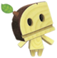

# Big Meaty Book of Races
{: .no_toc }

  

    Table of contents
  

  {: .text-delta }
- TOC
{:toc}

{: .center-img }

{: .specie-callout }
> ## Armad
> 
> {: .float-right-desktop }
> From *Super Mario Bros. Wonder*{: .italic }  
>
> These hardy desert wanderers stomp around in search of water. They live long lives, and have longer memories to go with it.
>
> ***+2 Heart**{: .heart-color}*{: .text-gamma .header-font }  
> *1 Power, 1 Defense*{: .text-gamma .header-font }
>
>  {: .specie-pros-callout }
> > *Pros*{: .text-gamma .header-font }  
> > *+ Athletics (Rolling)*{: .heart-color }  
> > *+ Knowhow (Desert)*{: .spirit-color }  
> > *+ Knowhow (History)*{: .spirit-color }  
>
> {: .specie-cons-callout }
> > *Cons*{: .text-gamma .header-font }  
> > Handless  
> > Weakness (Aerial)  
> > *You automatically retract into your shell; This leaves you completely Stunned (6) for the next 2 turns. If you are attacked from the front during this time, you knock into the ally behind you, dealing 2 damage to them, and ending your Stunned status.*{: .mgl .fs-3 }
> 
> {: .specie-inner-callout }
> > *Tech Defaults*{: .text-gamma .header-font }  
> >
> > Boost (Defense)  
> > *Indirect*{: .alt-grey-line }  
> > Secure  
> > *Simple*{: .alt-grey-line }
> > 
> >  *Optional:*{: .underlined } Variant (*Athletics - Primary Only*{: .heart-color }) on Indirect attacks. 
>  

{: .specie-callout }
> ## Baddie Box
>
> 
> {: .float-right-desktop }
> From *Super Mario 3D Land*{: .italic }  
>
> These bizarre blocks are capable of continuously conjuring enemies from within themselves. They have been seen conjuring other objects as well, but mooks and minions appear to be their specialty.
>
> ***+1 Heart**{: .heart-color }, **+1 Spirit**{: .spirit-color }*{: .text-gamma .header-font }  
> *1 Power, 1 Defense*{: .text-gamma .header-font }  
>
> {: .specie-pros-callout }
> > *Pros*{: .text-gamma .header-font }  
> > *+ Guard (Melee)*{: .heart-color }  
> > *+ Magic (Conjuring)*{: .spirit-color }  
> > *+ Steady (VS Status)*{: .courage-color }  
> > Efficient (Minions)
>
> {: .specie-cons-callout }
> > *Cons*{: .text-gamma .header-font }  
> > Handless
>
> {: .specie-inner-callout }
> > *Tech Defaults*{: .text-gamma .header-font }  
> >
> > Boost (Attack)  
> > *Indirect*{: .alt-grey-line }  
> > Minion  
> > *Weaken*{: .alt-grey-line }  
> >
>

{: .specie-callout }
> ## Blockstepper
>
> 
> {: .float-right-desktop }
> From *Super Mario 3D World*{: .italic }  
>
> Blocksteppers are nothing if not team players. Always marching at least in pairs, you'd be hard pressed to find a blockstepper without at least one staunch ally by their side.
>
> ***+1 Heart**{: .heart-color }, **+1 Courage**{: .courage-color }*{: .text-gamma .header-font }  
> *1 Power, 0 Defense*{: .text-gamma .header-font }  
>
> {: .specie-pros-callout }
> > *Pros*{: .text-gamma .header-font }  
> > *+ Coordination (Marching)*{: .heart-color }  
> > *+ Notice (Hiding)*{: .spirit-color }  
> > *+ Cheer (Rally Together)*{: .courage-color } 
>
> {: .specie-cons-callout }
> > *Cons*{: .text-gamma .header-font }  
> > Handless
>
> {: .specie-inner-callout }
> > *Tech Defaults*{: .text-gamma .header-font }  
> >
> > Boost (Any)  
> > *Minion (Blocksteppers)*{: .alt-grey-line }  
> > Repeat  
> > *Shared*{: .alt-grey-line }  
> >
>

{: .specie-callout }
> ## Bonnetter
>
> 
> {: .float-right-desktop }
> From *Super Mario Odyssey*{: .italic }  
>
> Bonnetters travel the world wide via airships of their likeness. They have an impeccable sense of fashion, and none would dare chastise a bonneeter's opinion on attire.  
>
> *Credit to **@deuceblitz**{: .courage-color } and **@lucydndprincess**{: .courage-color } on DIscord for help with the capture State.*{: .fs-3 }
>
> ***+1 Spirit**{: .spirit-color }*{: .text-gamma .header-font }  
> *1 Power, 0 Defense*{: .text-gamma .header-font }  
>
> {: .specie-pros-callout }
> > *Pros*{: .text-gamma .header-font }  
> > *+ Crafts (Vehicles)*{: .spirit-color }  
> > *or **+ Crafts (Headwar)**{: .spirit-color }*{: .mgl }  
> > *+ Knowhow (Style)*{: .spirit-color }  
> > *+ Persuade (Sales)*{: .courage-color }  
> > Hover
>
> {: .specie-cons-callout }
> > *Cons*{: .text-gamma .header-font }  
> > N/A
>
> {: .specie-inner-callout }
> > *Other Traits*{: .text-gamma .header-font }  
> > State (Capture)  
> > *By spending **2 FP**{: .spirit-color }, you can attempt to possess an enemy. This is considered a Charm technique that uses *Athletics*{: .heart-color }.*{: .mgl .fs-3 }  
> > *An enemy Charmed in this way takes your place in combat, and you must use your action to maintain the Charm. While you have an enemy charmed in this way, any damage the enemy would take is inflicted on you instead. You can maintain this Charm for a number of turns per grade of success.*{: .mgl .fs-3 }  
> > ***Nice!**{: .nice-color }: 1 turn*{: .mgl-big .fs-3 }  
> > ***Good!**{: .good-color }: 2 turns*{: .mgl-big .fs-3 }  
> > ***Great!**{: .great-color }: 3 turns*{: .mgl-big .fs-3 }  
> > ***Wonderful!**{: .wonderful-color }: 4 turns*{: .mgl-big .fs-3 }  
> > ***Excellent!**{: .excellent-color }: 5 turns*{: .mgl-big .fs-3 }  
> > ***Unbelievable!**{: .unbelievable-color }: 6 turns*{: .mgl-big .fs-3 }  
>
> {: .specie-inner-callout }
> > *Tech Defaults*{: .text-gamma .header-font }  
> >
> > Aerial  
> > *Daze x2*{: .alt-grey-line }  
> > Disorient  
> > *Throw*{: .alt-grey-line }  
> >
>

{: .specie-callout }
> ## Boomboxer
>
> 
> {: .float-right-desktop }
> These bizarre creatures have boombox-like protrusions sticking out of their heads. It's unclear if they make loud noises out of self-defense or because they like it, but they make good companions if you can handle their sudden outbursts.
> 
> *Created by **@piyohthegenius**{: .courage-color }*{: .fs-3 }
>
> ***+1 Heart**{: .heart-color }, **+1 Courage**{: .courage-color }*{: .text-gamma .header-font }   
> *1 Power, 0 Defense*{: .text-gamma .header-font }  
>
> {: .specie-pros-callout }
> > *Pros*{: .text-gamma .header-font }  
> > *+ Notice (Noise)*{: .spirit-color }  
> > *+ Bully (Deafening)*{: .courage-color }
> > *+ Perform (Music)*{: .courage-color }{: .mgl .fs-3 }
>
> {: .specie-cons-callout }
> > *Cons*{: .text-gamma .header-font }  
> > Weakness (Blast)
> > *You take +2 damage and are Stunned (1) for the number of turns equal to the damage taken.*{: .mgl .fs-3 }
>
> {: .specie-inner-callout }
> > *Tech Defaults*{: .text-gamma .header-font }  
> >
> > Burst  
> > *Element (Sound)*{: .alt-grey-line }  
> > Piercing  
> > *Ranged*{: .alt-grey-line }  
> >
>

{: .specie-callout }
> ## Bramball
>
> 
> {: .float-right-desktop }
> From *New Super Mario Bros. Wii*{: .italic }  
>
> The humble bramball strolls from place to place, not paying much mind to what's in its way, or where it's going. Many would describe a bramball as amicable, though not much for conversation, and being marvelous helps when in need of a quick pick-me-up.
>
> ***+1 Heart**{: .heart-color }, **+1 Spirit**{: .spirit-color }*{: .text-gamma .header-font }  
> *1 Power, 0 Defense*{: .text-gamma .header-font }  
>
> {: .specie-pros-callout }
> > *Pros*{: .text-gamma .header-font }  
> > *+ Coordination (Stomping)*{: .heart-color }  
> > *+ Knowhow (Flora)*{: .spirit-color }  
> > *+ Cheer (FP)*{: .courage-color }  
> > Contact  
> > *The attacker takes 1 damage, and you make a **Steady**{: .courage-color } check; the attacker is Dazed for 1 turn per Grade of Success.*{: .mgl .fs-3 }  
>
> {: .specie-cons-callout }
> > *Cons*{: .text-gamma .header-font }  
> > Handless  
> > Weakness (Aerial, Underfoot)  
> > *Aerial and Underfoot attacks ignore your Contact trait*{: .mgl .fs-3 }  
>
> {: .specie-inner-callout }
> > *Tech Defaults*{: .text-gamma .header-font }  
> >
> > Flowery  
> > *Overrun*{: .alt-grey-line }  
> > Piercing  
> > *Selective, Indirect*{: .alt-grey-line }  
> >
>

{: .specie-callout }
> ## Bristle
>
> 
> {: .float-right-desktop }
> 
> From *Paper Mario: The Thousand Year Door*{: .italic }
> 
> Bristles are autonomous sentinels, set to keep watch over the ruins of fallen civilizations. They delight in carrying out their duty, taking glee in fending off outsiders and threats.
> 
> ***+1 Heart**{: .heart-color}, **+1 Courage**{: .courage-color}*{: .text-gamma .header-font }  
> *1 Power, 2 Defense*{: .text-gamma .header-font }  
>
> {: .specie-pros-callout }
> > *Pros*{: .text-gamma .header-font }  
> > *+ Notice (Keep Watch){: .spirit-color }  
> > *+ Trickery (Camouflage){: .spirit-color }
> > *+ Steady (Balance)*{: .courage-color }  
> > Construct
> > Contact
> > *Your Contact trait can protect you from tool-based melee attacks.*{: .mgl .fs-3 }
> > Immune (Fire)
>
> {: .specie-cons-callout }
> > *Cons*{: .text-gamma .header-font }  
> > Weakness (Blast, Quake) 
> > *You are flipped over, and your Defense is negated for the duration. This leaves you completely Stunned (6) for 2 turns. You still retain your contact trait, though you are no longer protected from tool-based melee attacks.*{: .mgl .fs-3 }
> > Handless
>
>
> {: .specie-inner-callout }
> > *Tech Defaults*{: .text-gamma .header-font }  
> >
> > Counter
> > *Disarm x2*{: .alt-grey-line }  
> > Piercing
> > *Tool (Built-in)*{: .alt-grey-line }  
> >
> > Any *Required*{: .underlined } or *Optional*{: .underlined } effects are listed underneath, and can (or must) be taken in addition to Tech Defaults.
> 

{: .specie-callout }
> ## Brock
>
> 
> {: .float-right-desktop }
> From *Mario & Luigi: Bowser's Inside Story*{: .italic }  
>
> Brocks are best described as hardy and astute. Even the most humble of brocks know how to pitch a product. As such, many do work as merchants and salesmen, and have the bulk to keep their wares safe. 
>
> ***+1 Heart**{: .heart-color }, **+1 Courage**{: .courage-color }*{: .text-gamma .header-font }  
> *1 Power, 1 Defense*{: .text-gamma .header-font }  
>
> {: .specie-pros-callout }
> > *Pros*{: .text-gamma .header-font }  
> > *+ Guard (Ranged)*{: .heart-color }  
> > *+ Persuade (Sales)*{: .courage-color }  
> > *+ Steady (Etiquette)*{: .courage-color }  
> > 1 Resist (Ranged)  
> > \+ ½ starting coins
>
> {: .specie-cons-callout }
> > *Cons*{: .text-gamma .header-font }  
> > Weakness (Underfoot)  
> > *You are Dazed (1) for a number of turns equal to the damage dealt, and lose 1 coin per point of damage.*{: .mgl .fs-3 }  
>
> {: .specie-inner-callout }
> > *Tech Defaults*{: .text-gamma .header-font }  
> >
> > Alternative (Coins)  
> > *Boost (Defense)*{: .alt-grey-line }  
> > Charm  
> > *Hearty x2*{: .alt-grey-line }  
> >
>

{: .specie-callout }
> ## Broodal
>
> 
> {: .float-right-desktop }
> From *Super Mario Odyssey*{: .italic }  
>
> These brutal snobs come from the moon, and hold a reputation for their excellent sense of fashion and decor. Their bark can be just as bad, if not worse, than their bite. And a broodal would NEVER be caught dead without a stylish outfit, armed to the teeth with weaponry.
>
> ***+1 Heart**{: .heart-color }, **+1 Courage**{: .courage-color }*{: .text-gamma .header-font }  
> *1 Power, 0 Defense*{: .text-gamma .header-font }  
>
> {: .specie-pros-callout }
> > *Pros*{: .text-gamma .header-font }  
> > *+ Athletics (Jump)*{: .heart-color }  
> > *+ Knowhow (High Society)*{: .spirit-color }  
> > *+ Steady (Etiquette)*{: .courage-color }  
>
> {: .specie-cons-callout }
> > *Cons*{: .text-gamma .header-font }  
> > N/A
>
> {: .specie-inner-callout }
> > *Tech Defaults*{: .text-gamma .header-font }  
> >
> > Aerial  
> > *Repeat*{: .alt-grey-line }  
> > Sequential  
> > *Tool (Ranged)*{: .alt-grey-line }  
> >
>

{: .specie-callout }
> ## Bubblainian
>
> 
> {: .float-right-desktop }
> From *Super Mario Odyssey*{: .italic }  
>
> These laid-back gastropods are all about one thing: taking it easy. Relaxation is the motto of the bubblainians, and if something comes to disturb their peace, then they'll put together all their resources to return things to a carefree calm.
>
> ***+2 Courage**{: .courage-color }*{: .text-gamma .header-font }  
> *1 Power, 1 Defense*{: .text-gamma .header-font }  
>
> {: .specie-pros-callout }
> > *Pros*{: .text-gamma .header-font }  
> > *+ Athletics (Guard)*{: .heart-color }  
> > *+ Cheer (Relaxation)*{: .courage-color }  
> > *+ Perform (Instruments)*{: .courage-color }  
> > Aquatic
>
> {: .specie-cons-callout }
> > *Cons*{: .text-gamma .header-font }  
> > Weakness (Earth)  
> > *You take +2 damage and become Dazed (1) for a number of turns equal to the damage taken.*{: .mgl .fs-3 }  
>
> {: .specie-inner-callout }
> > *Tech Defaults*{: .text-gamma .header-font }  
> >
> > Allies  
> > *Boost (Defense)*{: .alt-grey-line }  
> > Charm  
> > *Flowery*{: .alt-grey-line }  
> >
>

{: .specie-callout }
> ## Bulrush
>
> 
> {: .float-right-desktop }
> 
> From *Super Mario Bros. Wonder*{: .italic }
> Bulrush are typically placid beasts roaming the grasslands of the world. But placid doesn’t mean harmless! They charge at each other as a greeting, which often leads many to be on the pointy end of their horns, warranted or not.
>
> ***+2 Heart**{: .heart-color}*{: .text-gamma .header-font }  
> *2 Power, 0 Defense*{: .text-gamma .header-font }  
>
> {: .specie-pros-callout }
> > *Pros*{: .text-gamma .header-font }  
> > *+ Athletics (Charge){: .heart-color }  
> > *+ Guard (Melee){: .heart-color }
> > *+ Bully (Shove)*{: .courage-color }  
> > {: .mgl .fs-3 }
>
> {: .specie-cons-callout }
> > *Cons*{: .text-gamma .header-font }  
> > Weakness (Charm/Confuse/Provoke) 
> > *The Level and Duration of any of these Statuses inflicted on you is doubled.*{: .mgl .fs-3 }
>
>
> {: .specie-inner-callout }
> > *Tech Defaults*{: .text-gamma .header-font }  
> >
> > Piercing
> > *Overrun*{: .alt-grey-line }  
> > Spillover  
> > *Stun*{: .alt-grey-line }  
> >
> > Any *Required*{: .underlined } or *Optional*{: .underlined } effects are listed underneath, and can (or must) be taken in addition to Tech Defaults.
> 

{: .specie-callout }
> ## Cataquack
>
> 
> {: .float-right-desktop }
> From *Super Mario Sunshine*{: .italic }  
>
> Cataquacks live idle lives, primarily on the beaches of tropical vistas. Notably, the closer their coloration is to red, the more aggressive they tend to be. Otherwise, they don"t often go looking for trouble, unless it brings itself to their proverbial front door.
>
> ***+2 Heart**{: .heart-color }*{: .text-gamma .header-font }  
> *1 Power, 0 Defense*{: .text-gamma .header-font }  
>
> {: .specie-pros-callout }
> > *Pros*{: .text-gamma .header-font }  
> > *+ Athletics (Run)*{: .heart-color }  
> > *+ Athletics (Flipping)*{: .heart-color }  
> > *+ Bully (Shove)*{: .courage-color }  
>
> {: .specie-cons-callout }
> > *Cons*{: .text-gamma .header-font }  
> > Handless  
> > Weakness (Water)  
> > *You are flipped over, Dazed (1) for a number of turns equal to the damage dealt.*{: .mgl .fs-3 }
>
> {: .specie-inner-callout }
> > *Tech Defaults*{: .text-gamma .header-font }  
> >
> > Launch  
> > *Sequential*{: .alt-grey-line }  
> > Throw  
> > *Underfoot*{: .alt-grey-line }  
> >
>

{: .specie-callout }
> ## Cherbil
>
> 
> {: .float-right-desktop }
> From *Super Paper Mario*{: .italic }  
>
> Enigmatic cloudy creatures, cherbils float using internalized gasses that they release in order to protect themselves. You don’t wanna know where the gas comes from. Trust us.
>
> ***+1 Spirit**{: .spirit-color }, **+1 Courage**{: .courage-color }*{: .text-gamma .header-font }  
> *1 Power, 0 Defense*{: .text-gamma .header-font }  
>
> {: .specie-pros-callout }
> > *Pros*{: .text-gamma .header-font }  
> > *+ Knowhow (Cuisine)*{: .spirit-color }  
> > *+ Knowhow (Intrigue)*{: .spirit-color }  
> > *+ Bully (Disgust)*{: .courage-color }  
> > Hover
> > Immune (Gases)
> > *Gas-based attacks and effects have no effect on you.*{: .mgl .fs-3 }
>
> {: .specie-cons-callout }
> > *Cons*{: .text-gamma .header-font }  
> > Handless
>
> {: .specie-inner-callout }
> > *Tech Defaults*{: .text-gamma .header-font }  
> >
> > Aerial
> > *Daze x2*{: .alt-grey-line }  
> > Lingering x2  
> > *Stun*{: .alt-grey-line }  
> >
>

{: .specie-callout }
> ## Coconutter
>
> 
> {: .float-right-desktop }
> From *Mario & Luigi: Partners in Time*{: .italic }  
>
> Coconutters live deep in jungles and tropics, fostering and growing nature around them. They don"t often take kindly to trespassers!  
> Credit to “Fernikart57” on DeviantArt for the art.
>
> ***+1 Heart**{: .heart-color }, **+1 Spirit**{: .spirit-color }*{: .text-gamma .header-font }  
> *1 Power, 0 Defense*{: .text-gamma .header-font }  
>
> {: .specie-pros-callout }
> > *Pros*{: .text-gamma .header-font }  
> > *+ Crafts (Tools)*{: .spirit-color }  
> > *+ Knowhow (Nature)*{: .spirit-color }  
> > *+ Perform (Chanting)*{: .courage-color }  
>
> {: .specie-cons-callout }
> > *Cons*{: .text-gamma .header-font }  
> > Weakness (Fire)  
> > *You take +2 damage and suffer from a Lingering burn, lasting a number of turns equal to the damage taken.*{: .mgl .fs-3 }
>
> {: .specie-inner-callout }
> > *Tech Defaults*{: .text-gamma .header-font }  
> >
> > Hearty x2  
> > *Lingering (Poison)*{: .alt-grey-line }  
> > Terrain (Rain)  
> > *Tool*{: .alt-grey-line }  
> >
>

{: .specie-callout }
> ## Crab
>
> 
> {: .float-right-desktop }
> From *Mario Bros.*{: .italic }  
>
> Sidesteppers, Huckits, Crabbers… crabs are plentiful across the world, going by many names. Easily agitated, one would be a fool to end up on the pointed part of their claws.
>
> ***+2 Heart**{: .heart-color }*{: .text-gamma .header-font }  
> *1 Power, 1 Defense*{: .text-gamma .header-font }  
>
> {: .specie-pros-callout }
> > *Pros*{: .text-gamma .header-font }  
> > *+ Aim (Fling)*{: .heart-color }  
> > *+ Guard (Melee)*{: .heart-color }  
> > *+ Notice (Underwater)*{: .spirit-color }  
> > Aquatic
>
> {: .specie-cons-callout }
> > *Cons*{: .text-gamma .header-font }  
> > Weakness (Blast, Quake)  
> > *You are flipped over, leaving you completely Stunned (6) for the next 2 turns. Your Defense is negated during this time.*{: .mgl .fs-3 }
>
> {: .specie-inner-callout }
> > *Tech Defaults*{: .text-gamma .header-font }  
> >
> > Counter 
> > *Disarm x2*{: .alt-grey-line }  
> > Piercing  
> > *Throw*{: .alt-grey-line }  
> >
>

{: .specie-callout }
> ## Cragnon
>
> 
> {: .float-right-desktop }
> From *Super Paper Mario*{: .italic }  
>
> These technologically advanced cavemen have an odd way of speaking. Though their speech isn't as intriguing as their Cragnology. Being masters of influencing rock to carry messages and signals, they've created a variety of programs to entertain themselves when not on the hunt.
>
> ***+1 Heart**{: .heart-color }, **+1 Courage**{: .courage-color }*{: .text-gamma .header-font }  
> *1 Power, 0 Defense*{: .text-gamma .header-font }  
>
> {: .specie-pros-callout }
> > *Pros*{: .text-gamma .header-font }  
> > *+ Coordination (Weapons)*{: .heart-color }  
> > *+ Knowhow (Rocks)*{: .spirit-color }  
> > *or **+ Notice (Tracking)**{: .spirit-color }*{: .mgl }  
> > *+ Perform (Acting)*{: .courage-color }
>
> {: .specie-cons-callout }
> > *Cons*{: .text-gamma .header-font }  
> > N/A
>
> {: .specie-inner-callout }
> > *Tech Defaults*{: .text-gamma .header-font }  
> >
> > Boost (Defense)  
> > *Daze x2*{: .alt-grey-line }  
> > Strike-Through  
> > *Tool*{: .alt-grey-line }  
> >
>

{: .specie-callout }
> ## Cursya
>
> 
> {: .float-right-desktop }
> From *Super Paper Mario*{: .italic }  
>
> These gooey terrors are chock-full of cursed energy. Even just grazing one can be enough to stir up some bad luck!
>
> ***+2 Spirit**{: .spirit-color }*{: .text-gamma .header-font }  
> *1 Power, 0 Defense*{: .text-gamma .header-font }  
>
> {: .specie-pros-callout }
> > *Pros*{: .text-gamma .header-font }  
> > *+ Guard (Melee)*{: .heart-color }  
> > *+ Magic (Curses)*{: .spirit-color }
> > *+ Bully (Weaken)*{: .spirit-color }
>
> {: .specie-cons-callout }
> > *Cons*{: .text-gamma .header-font }  
> > N/A
>
> {: .specie-inner-callout }
> > *Tech Defaults*{: .text-gamma .header-font }  
> >
> > Counter
> > *Stun*{: .alt-grey-line }  
> > Tutor (May not have any positive traits)
> > *Weaken (Any)*{: .alt-grey-line }  
> >
>

{: .specie-callout }
> ## Dorrie
>
> 
> {: .float-right-desktop }
> From *Super Mario 64*{: .italic }  
>
> Gentle giants of the seas and rivers, dorries often drift along, taking in the world as they go. They’re a little awkward on land, but otherwise make for lovely company.
>
> ***+2 Heart**{: .heart-color }*{: .text-gamma .header-font }  
> *1 Power, 0 Defense*{: .text-gamma .header-font }  
>
> {: .specie-pros-callout }
> > *Pros*{: .text-gamma .header-font }  
> > *+ Athletics (Swim)*{: .heart-color }  
> > *+ Coordination (Carrying)*{: .heart-color }
> > *+ Notice (Underwater)*{: .spirit-color }
> > Immune (Poison)
> > Aquatic
> > Carrier (In Water)
>
> {: .specie-cons-callout }
> > *Cons*{: .text-gamma .header-font }  
> > Handless
>
> {: .specie-inner-callout }
> > *Tech Defaults*{: .text-gamma .header-font }  
> >
> > Overrun
> > *Reach*{: .alt-grey-line }  
> > Selective
> > *Swap x2*{: .alt-grey-line }  
> >
>

{: .specie-callout }
> ## Dragon
>
> 
> {: .float-right-desktop }
> From *Super Mario 64*{: .italic }  
>
> Dragons are fearsome creatures, holding sway over powerful breath attacks, and commanding personalities. Being in the good graces of a dragon can be one of the strongest boons anyone can receive.
>
> ***+1 Heart**{: .heart-color }, **+1 Courage**{: .courage-color }*{: .text-gamma .header-font }  
> *1 Power, 1 Defense*{: .text-gamma .header-font }  
>
> {: .specie-pros-callout }
> > *Pros*{: .text-gamma .header-font }  
> > *+ Athletics (Fly)*{: .heart-color }  
> > *+ Notice (Treasure)*{: .spirit-color }
> > *+ Bully (Assert Self)*{: .courage-color }
> > Carrier
> > Fly
>
> {: .specie-cons-callout }
> > *Cons*{: .text-gamma .header-font }  
> > Waekness (Specific Noise)
> > *Choose a specific, common sound, such as a cricket’s chirp, thunderclaps, or a bell. Whenever you can hear this sound, your attack is Weakened (2), and you lose any defense points you have, for as long as you can hear the sound (minimum 1 turn).*{: .mgl .fs-3 }
>
> {: .specie-inner-callout }
> > *Tech Defaults*{: .text-gamma .header-font }  
> >
> > Burst
> > *Drain x2*{: .alt-grey-line }  
> > Element (Any, defined at character creation)
> > *Quake*{: .alt-grey-line }  
> >
>

{: .specie-callout }
> ## Emoglobin
> 
> {: .float-right-desktop }
> From *Mario & Luigi: Bowser's Inside Story*{: .italic }  
>
> Emoglobin are bizarre little antibodies that typically take up important functions in one's body. How they gain larger size, and how they escape their host bodies, is greatly unknown. What is known is that they excel at using their restorative properties to aid those around them. Just.. don’t ask where its healing comes from.
>
> ***+2 Heart**{: .heart-color }*{: .text-gamma .header-font }  
> *0 Power, 0 Defense*{: .text-gamma .header-font }  
>
> {: .specie-pros-callout }
> > *Pros*{: .text-gamma .header-font }  
> > *+ Heal (First Aid)*{: .heart-color }  
> > *+ Knowhow (Biology)*{: .spirit-color }  
> > *+ Steady (VS Status)*{: .courage-color }  
> > Hover  
> > Efficient (*First Aid*{: .heart-color })
>
> {: .specie-cons-callout }
> > *Cons*{: .text-gamma .header-font }  
> > Handless
>
> {: .specie-inner-callout }
> > *Tech Defaults*{: .text-gamma .header-font }  
> >
> > Boost 
> > *Dismiss*{: .alt-grey-line } 
> > Group
> > *Hearty x2*{: .alt-grey-line }  
> >
>

{: .specie-callout }
> ## Fake Block
>
> 
> {: .float-right-desktop }
> From *Super Mario 3D Land*{: .italic }  
>
> Sometimes, a block containing a power-up becomes suffused with the power in the item. This gives the block a spark of life, allowing it to move and use its powers to its own benefit.
>
> ***+2 Courage**{: .courage-color }*{: .text-gamma .header-font }  
> *1 Power, 0 Defense*{: .text-gamma .header-font }  
>
> {: .specie-pros-callout }
> > *Pros*{: .text-gamma .header-font }  
> > *+ Crafts (Power-Ups)*{: .spirit-color }  
> > *+ Trickery (Blend In)*{: .spirit-color }  
> > *+ Steady (Power-Ups)*{: .courage-color }  
> > Start with one Power-Up or Item worth 50 Coins or less  
> > Latent (Chosen Item/Power-Up)  
> > *For **5 FP**{: .spirit-color }: Activate the effect of your chosen Power-Up or Item (in the case of the Power-Up, you have to target yourself)*{: .mgl .fs-3 }
>
> {: .specie-cons-callout }
> > *Cons*{: .text-gamma .header-font }  
> > Handless  
> > Weakness (Underfoot)  
> > *You are Dazed (1) for a number of turns equal to the damage dealt, and you lose your active power-up if you have one.*{: .mgl .fs-3 }
>
> {: .specie-inner-callout }
> > *Tech Defaults*{: .text-gamma .header-font }  
> >
> > Aerial  
> > *Snatch*{: .alt-grey-line }  
> >
> > *Two of the following*{: .underlined }:  
> > Counter  
> > *Lingering x2*{: .alt-grey-line }  
> > Indirect  
> > *Ranged, Element (Any, related to chosen Power-Up or Item)*{: .alt-grey-line }  
> > Aquatic, Carrier, or Hover (as a Personal Trait)
> >
>

{: .specie-callout }
> ## Floro Sapien
>
> 
> {: .float-right-desktop }
> From *Super Mario 3D Land*{: .italic }  
>
> Distant relatives of dayzees, Floro Sapiens are extremely conscious of their environment. They work to keep it clean and safe, and often resort to hostility when they can’t fix the problem with good vibes.
>
> ***+2 Spirit**{: .spirit-color }*{: .text-gamma .header-font }  
> *1 Power, 0 Defense*{: .text-gamma .header-font }  
>
> {: .specie-pros-callout }
> > *Pros*{: .text-gamma .header-font }  
> > *+ Magic (IOnfluence)*{: .spirit-color }  
> > *+ Knowhow (Nature)*{: .spirit-color }  
> > *+ Steady (Thorns)*{: .courage-color }  
> > Immunity (Water)
> > *You heal **5 HP**{: .heart-color } instead.*{: .mgl .fs-3 }
> > 1 Resist (Earth)
>
> {: .specie-cons-callout }
> > *Cons*{: .text-gamma .header-font }  
> > Weakness (Poison)  
> > *You take +2 damage and are confused (3) for 2 turns.*{: .mgl .fs-3 }
>
> {: .specie-inner-callout }
> > *Tech Defaults*{: .text-gamma .header-font }  
> >
> > Alternate (HP), Indirect
> > *Charm*{: .alt-grey-line }  
> > Counter (Self)
> > *Daze x2*{: .alt-grey-line }
> > 
> > *Created by: @lonelyazalea*{: .italic }
>

{: .specie-callout }
> ## Fronk
>
> 
> {: .float-right-desktop }
> Fronks are bizarre little creatures found in most urban areas. They have an innate connection with technology, which can often put them into precarious situations when investigating machines.  
>
> ***+2 Spirit**{: .spirit-color }*{: .text-gamma .header-font }  
> *1 Power, 0 Defense*{: .text-gamma .header-font }  
>
> {: .specie-pros-callout }
> > *Pros*{: .text-gamma .header-font }
> > *+ Magic (Technology)*{: .spirit-color }  
> > *+ Knowhow (Hacking)*{: .spirit-color }
> > *+ Trickery (Stealth)*{: .spirit-color }
> > Clones (Copies)  
> > Efficient (Technology){: .mgl .fs-3 }
>
> {: .specie-cons-callout }
> > *Cons*{: .text-gamma .header-font }  
> > Weakness (Air)
> > *You must make a **Steady**{: .courage-color } check versus Disorientation, lasting a number of turns equal to the damage taken (minimum 1 turn).*{: .mgl .fs-3 }
>
> {: .specie-inner-callout }
> > *Tech Defaults*{: .text-gamma .header-font }  
> >
> > Repeat  
> > *Simple*{: .alt-grey-line }  
> > Selective  
> > *Tool*{: .alt-grey-line }  
> > 
> > *Concept: @yossycoin*{: .italic }
>

{: .specie-callout }
> ## Gamboo
>
> 
> {: .float-right-desktop }
> From *Super Mario Bros. Wonder*{: .italic }  
>
> Clans of gamboo travel the lands as one, speaking and acting in unison. Though sometimes, an individual gamboo may set out to start their own clan, or to find higher purpose. Even so, company is never far when traveling with a gamboo.
>
> ***+1 Spirit**{: .spirit-color }, **+1 Courage**{: .courage-color }*{: .text-gamma .header-font }  
> *1 Power, 0 Defense*{: .text-gamma .header-font }  
>
> {: .specie-pros-callout }
> > *Pros*{: .text-gamma .header-font }
> > *+ Crafts (Bamboo)*{: .spirit-color }  
> > *+ Trickery (Camouflage)*{: .spirit-color }
> > *+ Steady (Balance)*{: .courage-color }
> > {: .mgl .fs-3 }
>
> {: .specie-cons-callout }
> > *Cons*{: .text-gamma .header-font }  
> > Handless
> > {: .mgl .fs-3 }
>
> {: .specie-inner-callout }
> > *Tech Defaults*{: .text-gamma .header-font }  
> >
> > Indirect  
> > *Minion (Gamboo)*{: .alt-grey-line }  
> > Ranged  
> > *Sequential*{: .alt-grey-line }  
> > 
> > *Optional*{: .underlined }: Variant (*Steady*{: .courage-color }) on Minion techniques.
>

{: .specie-callout }
> ## Gearmo
>
> 
> {: .float-right-desktop }
> From *Super Mario Galaxy*{: .italic }  
>
> Gearmos are autonomous janitors, most well equipped for the care and maintenance of machinery. They can be very particular with keeping things clean, and are easily irked when things make their jobs harder.
>
> ***+1 Spirit**{: .spirit-color }, **+1 Courage**{: .courage-color }*{: .text-gamma .header-font }  
> *1 Power, 0 Defense*{: .text-gamma .header-font }  
>
> {: .specie-pros-callout }
> > *Pros*{: .text-gamma .header-font }  
> > *+ Crafts (Maintenance)*{: .spirit-color }  
> > *+ Knowhow (Machinery)*{: .spirit-color }  
> > *+ Bully (Chiding)*{: .courage-color }  
> > Construct (Lifelike)  
> > 1 Resist (Blast)
>
> {: .specie-cons-callout }
> > *Cons*{: .text-gamma .header-font }  
> > Weakness (Shock)  
> > *You become Dazed (1), lasting for a number of turns equal to the damage taken.*{: .mgl .fs-3 }
>
> {: .specie-inner-callout }
> > *Tech Defaults*{: .text-gamma .header-font }  
> >
> > Disarm x2
> > *Homing*{: .alt-grey-line }  
> > Swap x2  
> > *Tool (Built-In)*{: .alt-grey-line }  
> >
>

{: .specie-callout }
> ## Gooble
>
> 
> {: .float-right-desktop }
> From *Super Mario Sunshine*{: .italic }  
>
> Goobles come in all colors of the rainbow. Being made of paint, they have a knack for creativity that goes into everything they do.
>
> ***+1 Heart**{: .heart-color }, **+1 Courage**{: .courage-color }*{: .text-gamma .header-font }  
> *1 Power, 0 Defense*{: .text-gamma .header-font }  
>
> {: .specie-pros-callout }
> > *Pros*{: .text-gamma .header-font }  
> > *+ Athletics (Leaping)*{: .heart-color }  
> > *+ Crafts (Painting)*{: .spirit-color }  
> > *+ Bully (Poison)*{: .courage-color }  
> > Clones (Copies)  
> > Immune (Poison)  
> > *You heal **5 HP**{: .heart-color } instead.*{: .mgl .fs-3 }
>
> {: .specie-cons-callout }
> > *Cons*{: .text-gamma .header-font }  
> > Handless  
> > Weakness (Water)  
> > *You take double damage. If this Technique wouldn't usually deal damage, it deals 2 Piercing damage. Your Attack is Weakened (1) for a number of turns equal to the damage taken.*{: .mgl .fs-3 }
>
> {: .specie-inner-callout }
> > *Tech Defaults*{: .text-gamma .header-font }  
> >
> > Drain x2  
> > *Lingering x2*{: .alt-grey-line }  
> > Spillover  
> > *Terrain (Goop)*{: .alt-grey-line }  
> >
> > *Optional*{: .underlined }: Element (Poison) on Indirect or Ranged Techniques
>

{: .specie-callout }
> ## Gotchawrench
>
> 
> {: .float-right-desktop }
> From *Wrecking Crew*{: .italic }  
>
> These malignant tools are what happens when a tool goes for too long without use, growing resentful and finding use for themselves. Often, this leads to them causing trouble in order to make problems for them to fix. Despite the name, Gotchawrenches can take the form of most any hardware tool.
>
> ***+2 Heart**{: .heart-color }*{: .text-gamma .header-font }  
> *1 Power, 0 Defense*{: .text-gamma .header-font }  
>
> {: .specie-pros-callout }
> > *Pros*{: .text-gamma .header-font }  
> > *+ Athletics (Demolition)*{: .heart-color }  
> > *+ Crafts (Construction)*{: .spirit-color }  
> > *or **+ Crafts (Jury-Rig)**{: .spirit-color }*{: .mgl }  
> > *+ Trickery (Stealth)*{: .spirit-color }  
> > Construct (Lifelike)
>
> {: .specie-cons-callout }
> > *Cons*{: .text-gamma .header-font }  
> > N/A
>
> {: .specie-inner-callout }
> > *Tech Defaults*{: .text-gamma .header-font }  
> >
> > Daze x2  
> > *Piercing*{: .alt-grey-line }  
> > Quake  
> > *Tool (Built-In)*{: .alt-grey-line }  
> >
>

{: .specie-callout }
> ## Gushen
>
> 
> {: .float-right-desktop }
> From *Super Mario Odyssey*{: .italic }  
>
> Gushen are haughty sea creatures, priding themselves on their speed and their 'staches.
>
> ***+1 Heart**{: .heart-color }, **+1 Courage**{: .courage-color }*{: .text-gamma .header-font }  
> *1 Power, 0 Defense*{: .text-gamma .header-font }  
>
> {: .specie-pros-callout }
> > *Pros*{: .text-gamma .header-font }  
> > *+ Athletics (Propel)*{: .heart-color }  
> > *+ Aim (Spray)*{: .heart-color }  
> > *+ Poise (Etiquette)*{: .courage-color }  
> > Aquatic 
> > Fly
> > Hover
> > *You cannot use your fly or hover traits if you do not have access to water.*{: .mgl .fs-3 }
>
> {: .specie-cons-callout }
> > *Cons*{: .text-gamma .header-font }  
> > Handless
> > Weakness (Heatwave/Lava)
> > *You cannot use your fly or hover personal traits in battles where either of these conditions are present, unless there is a nearby source of water.*
>
> {: .specie-inner-callout }
> > *Tech Defaults*{: .text-gamma .header-font }  
> >
> > Element (Water)  
> > *Provoke x2*{: .alt-grey-line }  
> > Ranged  
> > *Spillover*{: .alt-grey-line }  
> >
> > *Optional*{: .underlined }: Element (Water) on Indirect or Ranged attacks
>

{: .specie-callout }
> ## Gusty
>
> 
> {: .float-right-desktop }
> Gusties are wind spirits who go wherever the wind blows. A gusty is as carefree as the spring breeze, never staying in one place for too long before setting off for the next new experience.
>
> ***+1 Heart**{: .heart-color }, **+1 Spirit**{: .spirit-color }*{: .text-gamma .header-font }  
> *1 Power, 0 Defense*{: .text-gamma .header-font }  
>
> {: .specie-pros-callout }
> > *Pros*{: .text-gamma .header-font }  
> > *+ Athletics (Flying)*{: .heart-color }  
> > *+ Knowhow (Navigation)*{: .spirit-color }  
> > *+ Bully (Pushover)*{: .courage-color }  
> > Hover
> > Fly
> > {: .mgl .fs-3 }
>
> {: .specie-cons-callout }
> > *Cons*{: .text-gamma .header-font }  
> > N/A
>
> {: .specie-inner-callout }
> > *Tech Defaults*{: .text-gamma .header-font }  
> >
> > Aerial
> > *Overrun*{: .alt-grey-line }  
> > Strike-Through
> >
> > *Optional*{: .underlined }: Element (Air) on Indirect attacks
>

{: .specie-callout }
> ## Honeybee
>
> 
> {: .float-right-desktop }
> From *Super Mario Galaxy*{: .italic }  
>
> Honeybees live out fulfilling lives creating honey for their colony, and carrying out the will of their queen. Some may leave their colonies to act as emissaries of their kingdom, or to see what the wider world holds for them.
>
> ***+2 Courage**{: .courage-color }*{: .text-gamma .header-font }  
> *1 Power, 0 Defense*{: .text-gamma .header-font }  
>
> {: .specie-pros-callout }
> > *Pros*{: .text-gamma .header-font }  
> > *+ Heal (Syrup)*{: .heart-color }  
> > *+ Trickery (Dodge)*{: .spirit-color }  
> > *+ Steady (Orderly)*{: .courage-color }  
> > Fly
>
> {: .specie-cons-callout }
> > *Cons*{: .text-gamma .header-font }  
> > N/A
>
> {: .specie-inner-callout }
> > *Tech Defaults*{: .text-gamma .header-font }  
> >
> > Aerial  
> > *Flowery*{: .alt-grey-line }  
> > Lingering x2 (Poison)  
> > *Strike-Through x2*{: .alt-grey-line }  
> >
>

{: .specie-callout }
> ## Inchworm Pipe
>
> 
> {: .float-right-desktop }
> From *Super Mario Bros. Wonder*{: .italic }  
>
> Pipes suffused with Wonder Power, inchworm pipes are often in constant motion. If an inchworm pipe wants to get somewhere, there’s little that can be done to stop it.
>
> ***+1 Heart**{: .heart-color }, **+1 Spirit**{: .spirit-color}*{: .text-gamma .header-font }  
> *1 Power, 1 Defense*{: .text-gamma .header-font }  
>
> {: .specie-pros-callout }
> > *Pros*{: .text-gamma .header-font }  
> > *+ Athletics (Climbing)*{: .heart-color }  
> > *+ Magic (Transport)*{: .spirit-color }  
> > *+ Trickery (Blend In)*{: .spirit-color }  
> > Carrier
> > Construct (Lifelike)
> > Sinker
>
> {: .specie-cons-callout }
> > *Cons*{: .text-gamma .header-font }  
> > Handless
>
> {: .specie-inner-callout }
> > *Tech Defaults*{: .text-gamma .header-font }  
> >
> > Divider  
> > *Overrun*{: .alt-grey-line }  
> > Ranged
> > *Swap x2*{: .alt-grey-line }  
> >
>

{: .specie-callout }
> ## Jibberjay
>
> 
> {: .float-right-desktop }
> These loud-mouthed avians live for the thrill of competition. They make their homes in jungles, where they can find challenging places to race each other.
>
> ***+2 Courage**{: .courage-color }*{: .text-gamma .header-font }  
> *1 Power, 0 Defense*{: .text-gamma .header-font }  
>
> {: .specie-pros-callout }
> > *Pros*{: .text-gamma .header-font }  
> > *+ Athletics (Flying)*{: .heart-color }  
> > *+ Bully (Taunting)*{: .courage-color }  
> > *+ Perform (Stylish Moves)*{: .courage-color }  
> > Fly
>
> {: .specie-cons-callout }
> > *Cons*{: .text-gamma .header-font }  
> > N/A
>
> {: .specie-inner-callout }
> > *Tech Defaults*{: .text-gamma .header-font }  
> >
> > Aerial  
> > *Boost (Dodge)*{: .alt-grey-line }  
> > Disable x2  
> > *Disorient*{: .alt-grey-line }  
> >
>

{: .specie-callout }
> ## Kerpop
>
> 
> {: .float-right-desktop }
> From *Super Mario Bros. Wonder*{: .italic }  
>
> Kerpops are distant relatives to goombas. Over time, they’ve adapted their bodies to the harsh volcanic conditions they dwell in, with built-in defense mechanisms for when things get too hot.
>
> ***+1 Heart**{: .heart-color}, **+1 Courage**{: .courage-color }*{: .text-gamma .header-font }  
> *1 Power, 0 Defense*{: .text-gamma .header-font }  
>
> {: .specie-pros-callout }
> > *Pros*{: .text-gamma .header-font }  
> > *+ Athletics (Jumping)*{: .heart-color }  
> > *+ Crafts (Cooking)*{: .spirit-color }  
> > *+ Bully (Loud Noises)*{: .courage-color }  
> > Immune (Fire)
> > *If targeted by a technique with Element (Fire), your hard body pops, lightening your weight. You gain a 1d6 bonus to any rolls relating to jumping or going airborne. While popped, your Immune (Fire) becomes 1 Resist (Fire). This lasts until the end of combat, or until the end of the scene.*{: .mgl .fs-3 }
>
> {: .specie-cons-callout }
> > *Cons*{: .text-gamma .header-font }  
> > Handless
>
> {: .specie-inner-callout }
> > *Tech Defaults*{: .text-gamma .header-font }  
> >
> > Aerial  
> > *Burst*{: .alt-grey-line }  
> > Disorient  
> > *Provoke x2*{: .alt-grey-line }  
> >
>

{: .specie-callout }
> ## Li'l Oink
>
> 
> {: .float-right-desktop }
> From *Paper Mario*{: .italic }  
>
> These bespeckled pigs are skittish little things, though are beloved by all for their patterns. They are creatures of chance, happening upon places and things they generally shouldn't.  
>
> *Created by **@lonelyazalea**{: .courage-color }*{: .fs-3 }
>
> ***+1 Heart**{: .heart-color }, **+1 Courage**{: .courage-color }*{: .text-gamma .header-font }  
> *1 Power, 0 Defense*{: .text-gamma .header-font }  
>
> {: .specie-pros-callout }
> > *Pros*{: .text-gamma .header-font }  
> > *+ Athletics (Fleeing)*{: .heart-color }  
> > *+ Notice (Movement)*{: .spirit-color }  
> > *+ Perform (Cuteness)*{: .courage-color }  
> > Immune (Confusion)
>
> {: .specie-cons-callout }
> > *Cons*{: .text-gamma .header-font }  
> > Handless
>
> {: .specie-inner-callout }
> > *Tech Defaults*{: .text-gamma .header-font }  
> >
> > All  
> > *Roulette (**-2 FP**{: .spirit-color } on one Roulette Slot)*{: .alt-grey-line }  
> > Lucky Hit, Fumble (-3 FP on the Lucky Slot)  
> > *Coin Toss (**-3 FP**{: .spirit-color } on one Coin Slot)*{: .alt-grey-line }  
> >
>

{: .specie-callout }
> ## Milde
>
> 
> {: .float-right-desktop }
> From *Paper Mario*{: .italic }  
>
> Mildes are known to be a cheerful and carefree bunch, not letting much get to them. They’re known for their precise movements and marching, though tend to be a little airheaded… especially when stomped on.
>
> *Created by **@lonelyazalea**{: .courage-color }*{: .fs-3 }
>
> ***+2 Courage**{: .courage-color}, or **+1 Heart**{: .heart-color }and **+1 Courage**{: .courage-color }*{: .text-gamma .header-font }  
> *1 Power, 0 Defense*{: .text-gamma .header-font }  
>
> {: .specie-pros-callout }
> > *Pros*{: .text-gamma .header-font }  
> > *+ Athletics (Popping)*{: .heart-color }  
> > *+ Coordination (Marching)*{: .heart-color }  
> > *+ Steady (Poise)*{: .courage-color }  
> > Clone (Copies)
> > **You may use *Athletics*{: .heart-color } in order to create a copy.**{: .mgl .fs-3 }
>
> {: .specie-cons-callout }
> > *Cons*{: .text-gamma .header-font }  
> > Handless
> > Weakness (Aerial)
> > *You take double damage, and are forced to create a copy. Each copy has -1 attack, increasing by -1 for every subsequent copy made this way.*{: .mgl .fs-3 }
>
> {: .specie-inner-callout }
> > *Tech Defaults*{: .text-gamma .header-font }  
> >
> > Burst
> > *Indirect*{: .alt-grey-line }  
> > Launch
> > 
> > *Created by: @piyohthegenius*{: .italic }
> > *CAUTION! With their weakness, a milde player can easily get out of hand in combat. Make sure to run this by your GM first!*{: .bold }
>

{: .specie-callout }
> ## Mister I
>
> 
> {: .float-right-desktop }
> From *Super Mario 64*{: .italic }  
>
> Mister Is are incredibly odd beings, being large floating eyeballs. Their disconcerting gaze is described as disturbing by some, and hypnotic by others. Usually, though, you can find them just.. float there.
>
> ***+2 Spirit**{: .spirit-color }*{: .text-gamma .header-font }  
> *1 Power, 0 Defense*{: .text-gamma .header-font }  
>
> {: .specie-pros-callout }
> > *Pros*{: .text-gamma .header-font }  
> > *+ Notice (Observations)*{: .spirit-color }  
> > *+ Notice (Secrets)*{: .spirit-color }  
> > *+ Bully (Unnerve)*{: .courage-color }  
> > Hover
>
> {: .specie-cons-callout }
> > *Cons*{: .text-gamma .header-font }  
> > Handless  
> > Weakness (Disoriented)  
> > *The Level and Duration of any Disoriented inflicted on you is doubled.*{: .mgl .fs-3 }
>
> {: .specie-inner-callout }
> > *Tech Defaults*{: .text-gamma .header-font }  
> >
> > Confuse x2  
> > *Fear x2*{: .alt-grey-line }  
> > Homing  
> > *Ranged*{: .alt-grey-line }  
> >
>

{: .specie-callout }
> ## New Donker
>
> 
> {: .float-right-desktop }
> From *Super Mario Odyssey*{: .italic }  
>
> Most New Donkers are just trying to get by. They're usually no-nonsense, but see the importance of taking time to wind down from work.
>
> ***+1 Spirit**{: .spirit-color }, **+1 Courage**{: .courage-color }*{: .text-gamma .header-font }  
> *1 Power, 0 Defense*{: .text-gamma .header-font }  
>
> {: .specie-pros-callout }
> > *Pros*{: .text-gamma .header-font }  
> > *+ Knowhow (Any one job, chosen at character creation)*{: .spirit-color }  
> > *+ Trickery (Join the Crowd)*{: .spirit-color }  
> > *+ Perform (Modern Hits)*{: .courage-color }  
>
> {: .specie-cons-callout }
> > *Cons*{: .text-gamma .header-font }  
> > N/A
>
> {: .specie-inner-callout }
> > *Tech Defaults*{: .text-gamma .header-font }  
> >
> > Alternative (Coins)  
> > *Tool*{: .alt-grey-line }  
> >
> > 1x Custom Set of Traits  
> > Custom Sets are defined during character creation. For New Donkers, they can include any Traits totalling no more than **2 FP**{: .spirit-color }, and can't include negative Traits.
> >
>

{: .specie-callout }
> ## Phanto
>
> 
> {: .float-right-desktop }
> From *Super Mario Bros. 2*{: .italic }  
>
> Phantos are ancient guardians of relics, most commonly found in ruins and dark places. What stirs them from their duty is largely unknown, but a phanto is utterly relentless in pursuit of its goals.
>
> ***+2 Spirit**{: .spirit-color }*{: .text-gamma .header-font }  
> *1 Power, 1 Defense*{: .text-gamma .header-font }  
>
> {: .specie-pros-callout }
> > *Pros*{: .text-gamma .header-font }  
> > *+ Knowhow (Lore)*{: .spirit-color }  
> > *+ Notice (Pursuit)*{: .spirit-color }  
> > *+ Trickery (Stealth)*{: .spirit-color }  
> > Construct (Lifelike)  
> > Fly
>
> {: .specie-cons-callout }
> > *Cons*{: .text-gamma .header-font }  
> > Handless
> > {: .mgl .fs-3 }
>
> {: .specie-inner-callout }
> > *Tech Defaults*{: .text-gamma .header-font }  
> >
> > Homing 
> > *Indirect*{: .alt-grey-line }  
> > Snatch  
> > *Strike-Through*{: .alt-grey-line }  
> >
>

{: .specie-callout }
> ## Pigarithm
>
> 
> {: .float-right-desktop }
> From *Super Paper Mario*{: .italic }  
>
> Pigarithm are flighty creatures, due in part to the large amount of coins they carry inside them at all times. The trust of a pigarithm is rarely earned, but represents a near unbreakable bond.
>
> ***+2 Heart**{: .heart-color }*{: .text-gamma .header-font }  
> *1 Power, 1 Defense*{: .text-gamma .header-font }  
>
> {: .specie-pros-callout }
> > *Pros*{: .text-gamma .header-font }  
> > *+ Athletics (Linear Speed)*{: .heart-color }  
> > *+ Notice (Coins)*{: .spirit-color }  
> > *+ Persuade (Commerce)*{: .courage-color }  
> > +½ Starting Coins
>
> {: .specie-cons-callout }
> > *Cons*{: .text-gamma .header-font }  
> > Handless
> > Weakness (Aerisl, Crushing)
> > *The Level and Duration of all Statuses you suffer from these attacks are doubled, and you lose 1 coin per point of damage.*{: .mgl .fs-3 }
>
> {: .specie-inner-callout }
> > *Tech Defaults*{: .text-gamma .header-font }  
> >
> > Alternative (Coins) 
> > *Boost (**Dodge**{: .spirit-color})*{: .alt-grey-line }  
> > Overrun  
> > *Minion (Split Selves)*{: .alt-grey-line }  
> >
> > *Created by: @lonelyazalea*{: .italic }
>

{: .specie-callout }
> ## Pi'illo
>
> 
> {: .float-right-desktop }
> From *Mario & Luigi: Dream Team*{: .italic }  
>
> The Pi'illo are an ancient people, hailing from Pi'illo Island. Though many are content to stay in their ancestral homes, the dreamy and longing nature of the Pi'illo folk lead them to travel beyond the island's shores. 
>
> ***+1 Spirit**{: .spirit-color }, **+1 Courage**{: .courage-color }*{: .text-gamma .header-font }  
> *1 Power, 0 Defense*{: .text-gamma .header-font }  
>
> {: .specie-pros-callout }
> > *Pros*{: .text-gamma .header-font }  
> > *+ Crafts (Bedwear)*{: .spirit-color }  
> > *+ Magic (Dreams)*{: .spirit-color }  
> > *+ Cheer (Inspire)*{: .courage-color }  
> > Hover  
>
> {: .specie-cons-callout }
> > *Cons*{: .text-gamma .header-font }  
> > Weakness (Sleep)  
> > *The Level and Duration of all statuses you suffer associated with sleep are doubled.*{: .mgl .fs-3 }
>
> {: .specie-inner-callout }
> > *Tech Defaults*{: .text-gamma .header-font }  
> >
> > Aerial  
> > *Daze x2*{: .alt-grey-line }  
> > Ranged  
> > *Tutor*{: .alt-grey-line }  
> >
>

{: .specie-callout }
> ## Pixl
>
> 
> {: .float-right-desktop }
> From *Super Paper Mario*{: .italic }  
>
> These geometric constructs were created from the spirits of the Game Overed by the shamans, fit into vessels for specific purposes. Though the means of their creation have been lost to all but the eldest of shamans, many still lie in wait in forgotten parts of the world.
>
> ***+1 Spirit**{: .spirit-color }, **+1 Courage**{: .courage-color }*{: .text-gamma .header-font }  
> *1 Power, 0 Defense*{: .text-gamma .header-font }  
>
> {: .specie-pros-callout }
> > *Pros*{: .text-gamma .header-font }  
> > *+ Knowhow (Ancient Lore)*{: .spirit-color }  
> > *+ Magic (Skill Substitution)*{: .spirit-color }  
> > *+ Cheer (Assist)*{: .courage-color }  
> > Construct (Lifelike)  
> > Fly
>
> {: .specie-cons-callout }
> > *Cons*{: .text-gamma .header-font }  
> > Handless
>
> {: .specie-inner-callout }
> > *Tech Defaults*{: .text-gamma .header-font }  
> >
> > Boost (Any)  
> > *Hustle, Others*{: .alt-grey-line }  
> > Tool (Built-In)  
> > *Tutor*{: .alt-grey-line }  
> >
>

{: .specie-callout }
> ## Poplin
>
> 
> {: .float-right-desktop }
> From *Super Mario Bros. Wonder*{: .italic }  
>
> Poplins are the residents of the Flower Kingdom, following the rule of Prince Florian. They often tend to gardens and wonder seeds, with flowers holding a special place in their society.
>
> ***+1 Spirit**{: .spirit-color }, **+1 Courage**{: .courage-color }*{: .text-gamma .header-font }  
> *1 Power, 0 Defense*{: .text-gamma .header-font }  
>
> {: .specie-pros-callout }
> > *Pros*{: .text-gamma .header-font }  
> > *+ Aim (Items)*{: .heart-color }  
> > *+ Knowhow (Flora)*{: .spirit-color }  
> > *+ Persuade (Sales)*{: .courage-color }  
> > Immune (Water)
> > *You heal **5 HP**{: .heart-color } instead.*{: .mgl .fs-3 }
> > +½ Syrup effectiveness (for items, as user or target)
>
> {: .specie-cons-callout }
> > *Cons*{: .text-gamma .header-font }  
> > Weakness (Heatwave)
> > *You are considered Disoriented (1) while in a heatwave.*{: .mgl .fs-3 }
>
> {: .specie-inner-callout }
> > *Tech Defaults*{: .text-gamma .header-font }  
> >
> > Flowery 
> > *Shared*{: .alt-grey-line }  
> > Terrain (Overgrown)
> > *Tool*{: .alt-grey-line }  
> > *Optional*{: .underlined }: Split on Flowery Techniques.
>

{: .specie-callout }
> ## Portrait Ghost
>
> 
> {: .float-right-desktop }
> From *Luigi's Mansion*{: .italic }  
>
> Portrait ghosts come from portraits of people who've died. They'll often become a mimicry of the person they were painted after, partaking in jobs and routines that the subject did in life.
>
> ***+2 Spirit**{: .spirit-color }*{: .text-gamma .header-font }  
> *1 Power, 0 Defense*{: .text-gamma .header-font }  
>
> {: .specie-pros-callout }
> > *Pros*{: .text-gamma .header-font }  
> > *+ Athletics (Telekinesis)*{: .heart-color }  
> > *+ Knowhow (Any, defined at character creation)*{: .spirit-color }  
> > *+ Trickery (Dodge)*{: .spirit-color }  
> > Hover  
> > Immune (Fear, Poison)  
> > Intangible  
> > Undead (Lifelike)
>
> {: .specie-cons-callout }
> > *Cons*{: .text-gamma .header-font }  
> > Weakness (Sudden Light)  
> > *You are stunned by the light, Dazing (1) you for a turn for each point of damage taken (minimum 1 turn).*{: .mgl .fs-3 }  
>
> {: .specie-inner-callout }
> > *Tech Defaults*{: .text-gamma .header-font }  
> >
> > Drain  
> > *Fear x2*{: .alt-grey-line }  
> > Launch  
> > *Throw*{: .alt-grey-line }  
> >
>

{: .specie-callout }
> ## Sammer Guy
>
> 
> {: .float-right-desktop }
> From *Super Paper Mario*{: .italic }  
>
> These valiant warriors come from the Sammer Kingdom. Each lives by their own personal code of honor, often finding work as mercenaries. But each guy fights for two things above all: glory for themselves, and for the Sammer Kingdom.
>
> ***+2 Heart**{: .heart-color }*{: .text-gamma .header-font }  
> *1 Power, 1 Defense*{: .text-gamma .header-font }  
>
> {: .specie-pros-callout }
> > *Pros*{: .text-gamma .header-font }  
> > *+ Coordination (Acrobatics)*{: .heart-color }  
> > *+ Guard (Melee)*{: .heart-color }  
> > *+ Bully (Intimidate)*{: .courage-color }  
>
> {: .specie-cons-callout }
> > *Cons*{: .text-gamma .header-font }  
> > N/A
>
> {: .specie-inner-callout }
> > *Tech Defaults*{: .text-gamma .header-font }  
> >
> > Counter  
> > *Fear x2*{: .alt-grey-line }  
> > Piercing  
> > *Tool (Indirect)*{: .alt-grey-line }  
> >
>

{: .specie-callout }
> ## Steam Gardener
>
> 
> {: .float-right-desktop }
> From *Super Mario Odyssey*{: .italic }  
>
> Gardening automatons who call the Wooded Kingdom home. Gardeners will often go on pilgrimages to distant lands to learn about new plants, and bring seeds back to their home.
>
> ***+1 Heart**{: .heart-color }, **+1 Spirit**{: .spirit-color }*{: .text-gamma .header-font }  
> *1 Power, 1 Defense*{: .text-gamma .header-font }  
>
> {: .specie-pros-callout }
> > *Pros*{: .text-gamma .header-font }  
> > *+ Aim (Watering)*{: .heart-color }  
> > *+ Crafts (Plants)*{: .spirit-color }  
> > *+ Knowhow (Flora)*{: .spirit-color }  
> > Construct (Lifelike)  
> > Sinker
>
> {: .specie-cons-callout }
> > *Cons*{: .text-gamma .header-font }  
> > N/A
>
> {: .specie-inner-callout }
> > *Tech Defaults*{: .text-gamma .header-font }  
> >
> > Dismiss  
> > *Flowery*{: .alt-grey-line }  
> > Ranged
> > *Spillover*{: .alt-grey-line } 
> >
> > *Optional*{: .underlined }: Element (Water) on Ranged attacks
>

{: .specie-callout }
> ## Shiverian
>
> 
> {: .float-right-desktop }
> From *Super Mario Odyssey*{: .italic }  
>
> These racers are as cheerful as their bodies are dense. Their thick fat helps them maneuver around without much use of their tiny legs, and helps them to protect what they care about. They adore friendly competition, and you'd be hard pressed to find a shiverian who backs down from a challenge.
>
> ***+2 Heart**{: .heart-color }*{: .text-gamma .header-font }  
> *1 Power, 0 Defense*{: .text-gamma .header-font }  
>
> {: .specie-pros-callout }
> > *Pros*{: .text-gamma .header-font }  
> > *+ Athletics (Bouncing)*{: .heart-color }  
> > *+ Guard (Melee)*{: .heart-color }  
> > *+ Steady (Balance)*{: .courage-color }  
> > 1 Resist (Ice)
>
> {: .specie-cons-callout }
> > *Cons*{: .text-gamma .header-font }  
> > N/A
>
> {: .specie-inner-callout }
> > *Tech Defaults*{: .text-gamma .header-font }  
> >
> > Aerial  
> > *Counter, Harmless*{: .alt-grey-line }  
> > Disorient  
> > *Stun*{: .alt-grey-line }  
> >
> > *Optional*{: .underlined }: Element (Ice) on Indirect attacks
>

{: .specie-callout }
> ## Shroob
>
> 
> {: .float-right-desktop }
> From *Mario & Luigi: Partners in Time*{: .italic }  
>
> Shroobs were once a race of fearsome aliens from Planet Shroob. Now, they've faced near extinction. The shroobs who still remain are just as shrewd and intelligent as their forefathers, and may one day seek to rise for another takeover...
>
> ***+1 Heart**{: .heart-color }, **+1 Spirit**{: .spirit-color }*{: .text-gamma .header-font }  
> *1 Power, 0 Defense*{: .text-gamma .header-font }  
>
> {: .specie-pros-callout }
> > *Pros*{: .text-gamma .header-font }  
> > *+ Aim (Rays)*{: .heart-color }  
> > *+ Crafts (Gadgets)*{: .spirit-color }  
> > *+ Knowhow (Biology)*{: .spirit-color }
>
> {: .specie-cons-callout }
> > *Cons*{: .text-gamma .header-font }  
> > N/A
>
> {: .specie-inner-callout }
> > *Tech Defaults*{: .text-gamma .header-font }  
> >
> > Minion (RC Drones)  
> > *Tool (Ranged)*{: .alt-grey-line }  
> > Variant (Crafts)  
> > *Weaken*{: .alt-grey-line }  
> >
>

{: .specie-callout }
> ## Squirpian
>
> 
> {: .float-right-desktop }
> From *Super Paper Mario*{: .italic }  
>
> Squirpians are a near-extinct race of aliens once trusted with guarding a pure heart. In times since then, they’ve roamed the galaxy with their purpose complete, seeking new meanings for their existence.
>
> ***+1 Heart**{: .heart-color }, **+1 Spirit**{: .spirit-color }*{: .text-gamma .header-font }  
> *1 Power, 0 Defense*{: .text-gamma .header-font }  
>
> {: .specie-pros-callout }
> > *Pros*{: .text-gamma .header-font }  
> > *+ Coordination (Piloting)*{: .heart-color }  
> > *+ Knowhow (Lore)*{: .spirit-color }  
> > *+ Cheer (Inspire)*{: .spirit-color }
> > Fly
>
> {: .specie-cons-callout }
> > *Cons*{: .text-gamma .header-font }  
> > N/A
>
> {: .specie-inner-callout }
> > *Tech Defaults*{: .text-gamma .header-font }  
> >
> > Boost (Any)
> > *Burst*{: .alt-grey-line }  
> > Provoke x2
> > *Ranged*{: .alt-grey-line }  
> >
>

{: .specie-callout }
> ## Talking Flower
>
> 
> {: .float-right-desktop }
> From *Super Paper Mario*{: .italic }  
>
> These Flower Kingdom fellows love nothing more than talking. They often travel far and wide, just to have a conversation partner.
>
> ***+2 Courage**{: .courage-color }*{: .text-gamma .header-font }  
> *1 Power, 0 Defense*{: .text-gamma .header-font }  
>
> {: .specie-pros-callout }
> > *Pros*{: .text-gamma .header-font }  
> > *+ Knowhow (Any, defined at character creation)*{: .spirit-color }  
> > *+ Cheer (Encourage)*{: .courage-color }  
> > *+ Persuade (Shmooze)*{: .courage-color }
> > Fly
>
> {: .specie-cons-callout }
> > *Cons*{: .text-gamma .header-font }  
> > Handless
>
> {: .specie-inner-callout }
> > *Tech Defaults*{: .text-gamma .header-font }  
> >
> > Boost
> > *Confuse x2*{: .alt-grey-line }  
> > Flowery
> > *Provoke x2*{: .alt-grey-line }  
> >
> > *Concept: @piyohthegenius*{: .italic }
>

{: .specie-callout }
> ## Theet
>
> 
> {: .float-right-desktop }
> From *Princess Peach: Showtime!*{: .italic }  
>
> Theets are patrons of the arts, forming some of the best acting troupes around. Though prone to stage fright, there’s very little that will stop a theet from putting on a good show.
>
> ***+2 Courage**{: .courage-color }*{: .text-gamma .header-font }  
> *1 Power, 0 Defense*{: .text-gamma .header-font }  
>
> {: .specie-pros-callout }
> > *Pros*{: .text-gamma .header-font }  
> > *Trickery (Disguise)*{: .spirit-color }
> > *or **Crafts (Costumes)**{: .spirit-color }*{: .mgl }
> > *+ Cheer (Teamwork)*{: .courage-color }  
> > *+ Perform (Theatrics)*{: .courage-color }
> > Fly
>
> {: .specie-cons-callout }
> > *Cons*{: .text-gamma .header-font }  
> > Weakness (Fear)
> > *The Level and Duration of all Statuses you suffer associated with fear are doubled.*{: .mgl .fs-3 }
>
> {: .specie-inner-callout }
> > *Tech Defaults*{: .text-gamma .header-font }  
> >
> > Allies
> > *Daze x2*{: .alt-grey-line }  
> > Element (Light)
> > *Flowery*{: .alt-grey-line }  
> > 
>

{: .specie-callout }
> ## Tiki
>
> 
> {: .float-right-desktop }
> From *Donkey Kong Country Returns*{: .italic }  
>
> Tikis are a proud race of self-made, fruit fueled tribesmen. They possess great talent in music, which they often use to create disorienting and hypnotic songs to gain the upper hand.
>
> ***+1 Spirit**{: .spirit-color }, **+1 Courage**{: .courage-color }*{: .text-gamma .header-font }  
> *1 Power, 0 Defense*{: .text-gamma .header-font }  
>
> {: .specie-pros-callout }
> > *Pros*{: .text-gamma .header-font }  
> > *+ Crafts (Woodworking)*{: .spirit-color }  
> > *+ Magic (Hypnotism)*{: .spirit-color }  
> > *+ Perform (Music)*{: .courage-color }  
> > Construct (Lifelike)  
> > Hover
>
> {: .specie-cons-callout }
> > *Cons*{: .text-gamma .header-font }  
> > Handless, or Weakness (Crushing)  
> > *You take +2 damage and fall to the ground. This leaves you Dazed (1) for a number of turns equal to the damage dealt.*{: .mgl .fs-3 }
>
> {: .specie-inner-callout }
> > *Tech Defaults*{: .text-gamma .header-font }  
> >
> > Charm  
> > *Confuse x2*{: .alt-grey-line }  
> > Disorient  
> > *Element (Fire)*{: .alt-grey-line }  
> >
>

{: .specie-callout }
> ## Topman
>
> 
> {: .float-right-desktop }
> From *Super Mario Galaxy*{: .italic }  
>
> Topmen are a tribe of spacefaring robots, constantly seeking territory. They often settle clashes by crashing into each other, seeing who falls first. Topmen are often honorable in the art of combat, using the bulk of their body to take down their foes.
>
> ***+1 Heart**{: .heart-color }, **+1 Courage**{: .courage-color }*{: .text-gamma .header-font }  
> *1 Power, 1 Defense*{: .text-gamma .header-font }  
>
> {: .specie-pros-callout }
> > *Pros*{: .text-gamma .header-font }  
> > *+ Athletics (Spinning)*{: .heart-color }  
> > *+ Bully (Knock Around)*{: .courage-color }  
> > *+ Steady (Balance)*{: .courage-color }  
> > Construct (Lifelike)  
> > Sinker
>
> {: .specie-cons-callout }
> > *Cons*{: .text-gamma .header-font }  
> > Weakness (Shock)  
> > *You take +2 damage and become Dazed (1) for a number of turns equal to the damage taken.*{: .mgl .fs-3 }
>
> {: .specie-inner-callout }
> > *Tech Defaults*{: .text-gamma .header-font }  
> >
> > Counter  
> > *Disorient*{: .alt-grey-line }  
> > Divider  
> > *Launch*{: .alt-grey-line }  
> >
>

{: .specie-callout }
> ## Tostarenan
>
> 
> {: .float-right-desktop }
> From *Super Mario Odyssey*{: .italic }  
>
> These fiesta loving skeletons call the sand kingdom home. Though when they leave the sands of Tostarena behind, they always bring the party with them.
>
> ***+2 Courage**{: .courage-color }*{: .text-gamma .header-font }  
> *1 Power, 0 Defense*{: .text-gamma .header-font }  
>
> {: .specie-pros-callout }
> > *Pros*{: .text-gamma .header-font }  
> > *+ Trickery (Parlour Tricks)*{: .spirit-color }  
> > *+ Cheer (Celebrations)*{: .courage-color }  
> > *+ Perform (Instruments)*{: .courage-color }  
> > Resilient  
> > Undead (Lifelike)
>
> {: .specie-cons-callout }
> > *Cons*{: .text-gamma .header-font }  
> > Weakness (Blast)  
> > *You take +2 damage and become Dazed (1) for a number of turns equal to the damage taken.*{: .mgl .fs-3 }
>
> {: .specie-inner-callout }
> > *Tech Defaults*{: .text-gamma .header-font }  
> >
> > Allies  
> > *Boost (Any)*{: .alt-grey-line }  
> > Charm  
> > *Dismiss*{: .alt-grey-line }  
> >
>

{: .specie-callout }
> ## Tox Box
>
> 
> {: .float-right-desktop }
> From *Super Mario 64*{: .italic }  
>
> Tox Boxes follow patterns their whole life, idly rolling about. Unless, of course, something stops them from completing their pattern, in which case they begin to wander around..
>
> ***+2 Heart**{: .heart-color }*{: .text-gamma .header-font }  
> *1 Power, 1 Defense*{: .text-gamma .header-font }  
>
> {: .specie-pros-callout }
> > *Pros*{: .text-gamma .header-font }  
> > *+ Athletics (Run Over)*{: .heart-color }  
> > *+ Guard (Melee)*{: .heart-color }  
> > *+ Bully (Knock Over)*{: .courage-color }  
> > Construct  
> > Sinker
>
> {: .specie-cons-callout }
> > *Cons*{: .text-gamma .header-font }  
> > Handless
>
> {: .specie-inner-callout }
> > *Tech Defaults*{: .text-gamma .header-font }  
> >
> > Daze x2  
> > *Overrun*{: .alt-grey-line }  
> > Secure, Others  
> > *Sequential*{: .alt-grey-line }  
> >
>

{: .specie-callout }
> ## Tsubon
>
> 
> {: .float-right-desktop }
> From *Mario & Wario*{: .italic }  
>
> These cursed urns often serve as mindless guards of caverns and temples. Though, there are a few among them who gain a heightened sense of self, setting out to find purpose in the world.
>
> ***+2 Heart**{: .heart-color }*{: .text-gamma .header-font }  
> *1 Power, 0 Defense*{: .text-gamma .header-font }  
>
> {: .specie-pros-callout }
> > *Pros*{: .text-gamma .header-font }  
> > *+ Aim (Projectiles)*{: .heart-color }  
> > *+ Athletics (Climbing)*{: .heart-color }  
> > *+ Crafts (Pottery)*{: .spirit-color }  
> > Construct (Lifelike)
>
> {: .specie-cons-callout }
> > *Cons*{: .text-gamma .header-font }  
> > Weakness (Launch/Throw)  
> > *If targeted by a move with the Launch or Thrown tags, your pottery cracks. You are Weakened (-1 POW) for a turn for each point of damage taken (minimum 1 turn).*{: .mgl .fs-3 }
>
> {: .specie-inner-callout }
> > *Tech Defaults*{: .text-gamma .header-font }  
> >
> > *Lingering x2*{: .alt-grey-line }  
> > Piercing
> > *Ranged*{: .alt-grey-line }  
> > Repeat  
> >
> > *Optional*{: .underlined }: Element (Any) on Ranged attacks. (Must be decided at character creation)
>

{: .specie-callout }
> ## Twilighter
>
> 
> {: .float-right-desktop }
> From *Paper Mario: The Thousand Year Door*{: .italic }  
>
> These shady folk prefer the darker corners of the world. Though their disposition may be gloomy, they're hardy survivors who will stand for the safety of friends and family. Though, they may just take the longer or less noticeable route to success.
>
> ***+2 Spirit**{: .spirit-color }*{: .text-gamma .header-font }  
> *1 Power, 0 Defense*{: .text-gamma .header-font }  
>
> {: .specie-pros-callout }
> > *Pros*{: .text-gamma .header-font }  
> > *+ Crafts (Stitching)*{: .spirit-color }  
> > *+ Trickery (Hiding)*{: .spirit-color }  
> > *+ Bully (Coerce)*{: .courage-color }  
> > Resilient
>
> {: .specie-cons-callout }
> > *Cons*{: .text-gamma .header-font }  
> > Weakness (Curses)  
> > *The duration of effects caused by curses are doubled.*{: .mgl .fs-3 }  
> > Weakness (Sudden Light)  
> > *You are stunned by the light, Dazing (1) you for a turn for each point of damage taken (minimum 1 turn).*{: .mgl .fs-3 }  
>
> {: .specie-inner-callout }
> > *Tech Defaults*{: .text-gamma .header-font }  
> >
> > Daze x2  
> > *Repeat*{: .alt-grey-line }  
> > Snatch  
> > *Terrain (Darkness)*{: .alt-grey-line }  
> >
> > *Optional*{: .underlined }: Element (Shadow) on Indirect or Ranged Techniques
>

{: .specie-callout }
> ## Uproot
>
> 
> {: .float-right-desktop }
> From *Super Mario Odyssey*{: .italic }  
>
> Uproots dwell in deep forests, creating shells to protect themselves from the elements. Weirdly enough, the shells they make often resemble plant pots..
>
> ***+2 Heart**{: .heart-color }*{: .text-gamma .header-font }  
> *1 Power, 0 Defense*{: .text-gamma .header-font }  
>
> {: .specie-pros-callout }
> > *Pros*{: .text-gamma .header-font }  
> > *+ Athletics (Jumping)*{: .heart-color }  
> > *+ Guard (Melee)*{: .heart-color }  
> > *+ Crafts (Ceramics)*{: .spirit-color }  
> > Elevation
>
> {: .specie-cons-callout }
> > *Cons*{: .text-gamma .header-font }  
> > N/A
>
> {: .specie-inner-callout }
> > *Tech Defaults*{: .text-gamma .header-font }  
> >
> > Aerial  
> > *Indirect*{: .alt-grey-line }  
> > Reach  
> > *Repeat*{: .alt-grey-line }  
> >
>

{: .specie-callout }
> ## Virus
>
> 
> {: .float-right-desktop }
> From *Dr. Mario*{: .italic }  
>
> Viruses are naughty little creatures, most often set to inflict their ails on whoever they come across. Even so, when faced with threats much greater than one of their own, their camaraderie is second to none, joining forces to take on tough foes.
>
> ***+1 Spirit**{: .spirit-color }, **+1 Courage**{: .courage-color }*{: .text-gamma .header-font }  
> *1 Power, 0 Defense*{: .text-gamma .header-font }  
>
> {: .specie-pros-callout }
> > *Pros*{: .text-gamma .header-font }  
> > *+ Knowhow (Medicine)*{: .spirit-color }  
> > *+ Trickery (Shenanigans)*{: .spirit-color }  
> > *+ Bully (Weaken)*{: .courage-color }  
> > Clone (Copies)
>
> {: .specie-cons-callout }
> > *Cons*{: .text-gamma .header-font }  
> > Weakness (Life Magic, Medicine)  
> > *You treat the **HP**{: .heart-color } you would normally recover as damage.*{: .mgl .fs-3 }
>
> {: .specie-inner-callout }
> > *Tech Defaults*{: .text-gamma .header-font }  
> >
> > Confuse x2  
> > *Disable x2*{: .alt-grey-line }  
> > Lingering x2 (Sickness)  
> > *Weaken*{: .alt-grey-line }  
> >
>

{: .specie-callout }
> ## Volbonan
>
> 
> {: .float-right-desktop }
> From *Super Mario Odyssey*{: .italic }  
>
> These expert chefs call the Luncheon Kingdom home. The travelers amongst them are always searching for new flavors for their dishes, and new meals to sample. Wherever a Volbonan goes, tasty food is sure to follow.  
>
> *Credit to "Lwiis64" on DeviantArt for the art.*{: .fs-3 }  
>
> ***+1 Heart**{: .heart-color }, **+1 Spirit**{: .spirit-color }*{: .text-gamma .header-font }  
> *1 Power, 0 Defense*{: .text-gamma .header-font }  
>
> {: .specie-pros-callout }
> > *Pros*{: .text-gamma .header-font }  
> > *+ Aim (Throw Item)*{: .heart-color }  
> > *+ Crafts (Food)*{: .spirit-color }  
> > *+ Knowhow (Culinary)*{: .spirit-color }  
> > 1 Resist (Fire)
>
> {: .specie-cons-callout }
> > *Cons*{: .text-gamma .header-font }  
> > N/A
>
> {: .specie-inner-callout }
> > *Tech Defaults*{: .text-gamma .header-font }  
> >
> > Element (Fire)  
> > *Hearty x2*{: .alt-grey-line }  
> > Launch  
> > *Piercing*{: .alt-grey-line }  
> >
>

{: .specie-callout }
> ## Waddlewing
>
> 
> {: .float-right-desktop }
> From *Super Mario Odyssey*{: .italic }  
>
> Waddlewings are deft little creatures, capable of gliding through the air with ease. Many waddlewings find a hobby in collecting objects.
>
> ***+1 Heart**{: .heart-color }, **+1 Courage**{: .courage-color }*{: .text-gamma .header-font }  
> *1 Power, 0 Defense*{: .text-gamma .header-font }  
>
> {: .specie-pros-callout }
> > *Pros*{: .text-gamma .header-font }  
> > *+ Athletics (Climb)*{: .heart-color }  
> > *+ Athletics (Glide)*{: .heart-color }  
> > *+ Bully (Snatch)*{: .courage-color }  
> > Fly
> > *When using this trait to Fly, you only stay airborne for a number of Turns equal to the Grades of Success you rolled to become airborne in the first place.*{: .mgl .fs-3 }
>
> {: .specie-cons-callout }
> > *Cons*{: .text-gamma .header-font }  
> > N/A
>
> {: .specie-inner-callout }
> > *Tech Defaults*{: .text-gamma .header-font }  
> >
> > Aerial
> > *Disarm x2*{: .alt-grey-line }  
> > Reach
> > *Snatch*{: .alt-grey-line }  
> >
> > *Credit to @lucydndprincess for fly mechanic.*{: .italic }
>

{: .specie-callout }
> ## Whittle
>
> 
> {: .float-right-desktop }
> From *Super Mario Galaxy 2*{: .italic }  
>
> Whittles are tree spirits, well known the world over for their bravery and pride. Though they may be lacking in conversation skills, a whittle is a stalwart friend, dedicated to whatever they may deem their cause to be.
>
> ***+1 Heart**{: .heart-color }, **+1 Spirit**{: .spirit-color }*{: .text-gamma .header-font }  
> *1 Power, 1 Defense*{: .text-gamma .header-font }  
>
> {: .specie-pros-callout }
> > *Pros*{: .text-gamma .header-font }  
> > *+ Athletics (Sliding)*{: .heart-color }  
> > *+ Knowhow (Plants)*{: .spirit-color }  
> > *+ Steady (Resilience)*{: .courage-color }  
> > Immune (Fear)
>
> {: .specie-cons-callout }
> > *Cons*{: .text-gamma .header-font }  
> > Weakness (Fire)  
> > *You take a +2 damage and suffer from a Lingering burn, lasting a number of turns equal to the damage taken.*{: .mgl .fs-3 }
>
> {: .specie-inner-callout }
> > *Tech Defaults*{: .text-gamma .header-font }  
> >
> > Aerial  
> > *Hearty x2*{: .alt-grey-line }  
> > Overrun  
> > *Strike-Through x2*{: .alt-grey-line }  
> >
>
